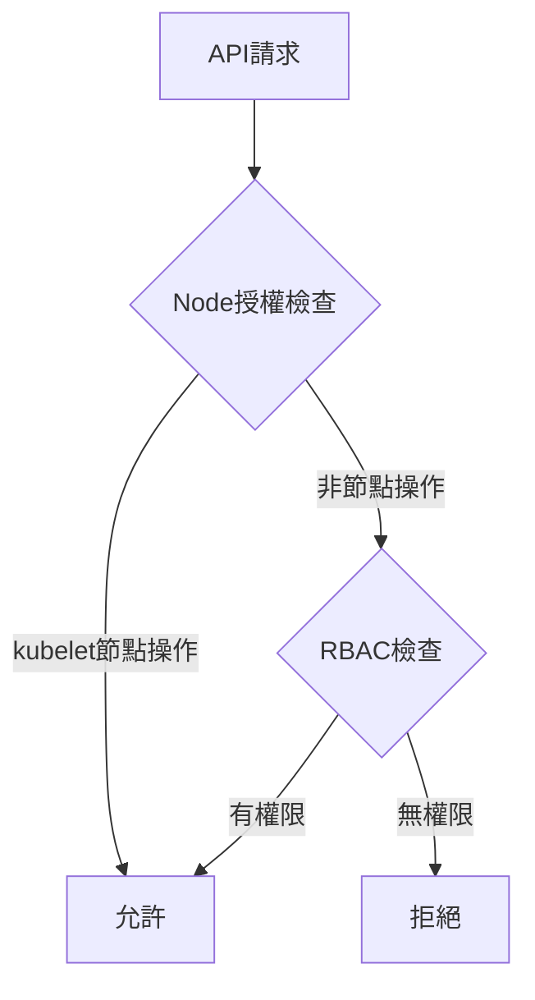
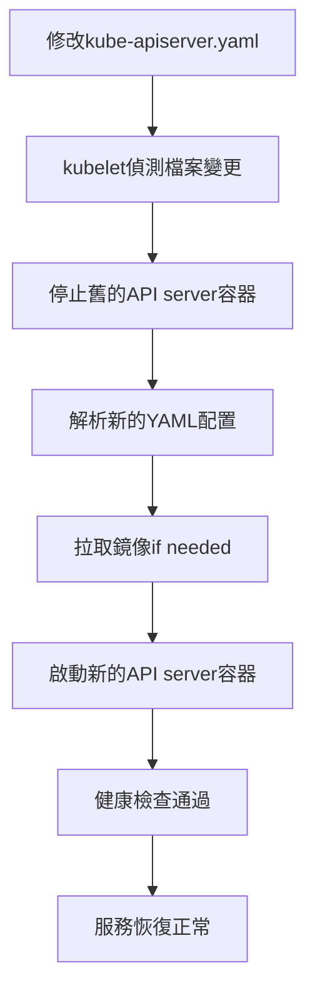
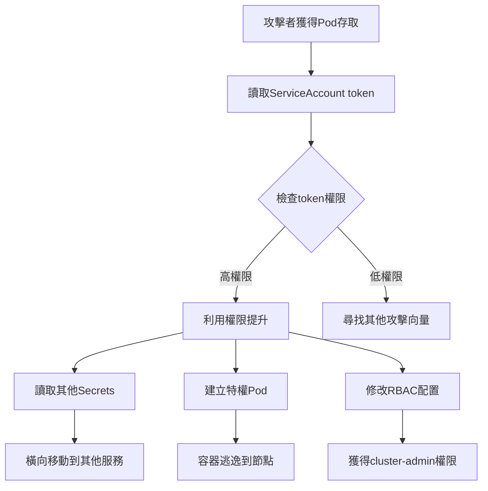

這些檢查是Kubernetes安全審計中的重要步驟，讓我詳細說明每個檢查的目的和潛在危害：

## 1. 檢查cluster-admin權限

**檢查目的：**
- 列出所有擁有cluster-admin權限的使用者、服務帳戶或群組
- cluster-admin是Kubernetes中權限最高的角色，擁有集群的完全控制權

**潛在危害：**
- **權限過度授予**：不必要的人員或服務擁有最高權限
- **橫向移動風險**：攻擊者一旦獲得cluster-admin權限，可以完全控制整個集群
- **資料洩漏**：可以讀取所有命名空間的所有資源，包括敏感資料如Secrets
- **惡意操作**：可以刪除、修改任何資源，甚至摧毀整個集群

## 2. 檢查預設ServiceAccount的權限

**檢查目的：**
- 確認預設的ServiceAccount是否被授予過多權限
- 預設ServiceAccount會自動掛載到沒有明確指定ServiceAccount的Pod中

**潛在危害：**
- **權限提升攻擊**：如果預設ServiceAccount擁有過多權限，任何Pod都可能濫用這些權限
- **容器逃逸**：攻擊者可能利用預設ServiceAccount的權限從容器內部攻擊Kubernetes API
- **批量影響**：因為是預設帳戶，影響範圍可能很廣
- **無意間的權限授予**：開發人員可能不知道他們的應用程式擁有額外權限

## 3. 檢查匿名使用者權限

**檢查目的：**
- 檢查是否有授權給匿名使用者（未認證的請求）的權限
- 匿名使用者代表任何未經身份驗證的請求

**潛在危害：**
- **未授權存取**：任何人都可以存取被授權給匿名使用者的資源
- **資訊洩露**：攻擊者無需認證就能獲取敏感資訊
- **拒絕服務攻擊**：匿名使用者如果有寫入權限，可能被用來進行DoS攻擊
- **集群探測**：攻擊者可以匿名探測集群結構和配置

## 安全建議

1. **最小權限原則**：只授予必要的最小權限
2. **定期審計**：定期檢查這些權限綁定
3. **移除預設權限**：確保預設ServiceAccount沒有不必要的權限
4. **禁用匿名存取**：在生產環境中通常應該禁用匿名存取
5. **使用專用ServiceAccount**：為每個應用程式建立專用的ServiceAccount
6. **實施RBAC**：使用細粒度的RBAC策略替代過於寬泛的權限

這些檢查是Kubernetes安全防護的基礎，定期執行有助於維護集群的安全狀態。


以下是針對這些安全問題的具體改善方案：

## 1. cluster-admin權限改善

### 立即行動
```bash
# 檢查當前cluster-admin綁定
kubectl get clusterrolebindings -o yaml | grep -A 10 -B 5 cluster-admin

# 移除不必要的cluster-admin綁定
kubectl delete clusterrolebinding <不必要的綁定名稱>
```

### 建立替代方案
```yaml
# 建立限制範圍的管理員角色
apiVersion: rbac.authorization.k8s.io/v1
kind: ClusterRole
metadata:
  name: namespace-admin
rules:
- apiGroups: [""]
  resources: ["*"]
  verbs: ["*"]
- apiGroups: ["apps", "extensions"]
  resources: ["*"]
  verbs: ["*"]
# 排除敏感資源
- apiGroups: [""]
  resources: ["nodes", "persistentvolumes"]
  verbs: ["get", "list"]  # 只給讀取權限
```

### 實施緊急存取機制
```yaml
# 使用時間限制的角色綁定
apiVersion: rbac.authorization.k8s.io/v1
kind: ClusterRoleBinding
metadata:
  name: emergency-admin
  annotations:
    # 記錄到期時間和原因
    expires: "2024-12-31T23:59:59Z"
    reason: "緊急維護需求"
subjects:
- kind: User
  name: emergency-user
  apiGroup: rbac.authorization.k8s.io
roleRef:
  kind: ClusterRole
  name: cluster-admin
  apiGroup: rbac.authorization.k8s.io
```

## 2. 預設ServiceAccount權限改善

### 禁用自動掛載
```yaml
# 在命名空間層級禁用
apiVersion: v1
kind: ServiceAccount
metadata:
  name: default
  namespace: production
automountServiceAccountToken: false
```

### Pod層級控制
```yaml
apiVersion: v1
kind: Pod
metadata:
  name: secure-pod
spec:
  serviceAccountName: custom-sa  # 使用專用ServiceAccount
  automountServiceAccountToken: false  # 或者明確禁用
  containers:
  - name: app
    image: myapp:latest
```

### 建立專用ServiceAccount
```yaml
apiVersion: v1
kind: ServiceAccount
metadata:
  name: app-service-account
  namespace: production
automountServiceAccountToken: true

---
apiVersion: rbac.authorization.k8s.io/v1
kind: Role
metadata:
  name: app-role
  namespace: production
rules:
- apiGroups: [""]
  resources: ["configmaps", "secrets"]
  verbs: ["get", "list"]
- apiGroups: [""]
  resources: ["pods"]
  verbs: ["get", "list", "watch"]

---
apiVersion: rbac.authorization.k8s.io/v1
kind: RoleBinding
metadata:
  name: app-role-binding
  namespace: production
subjects:
- kind: ServiceAccount
  name: app-service-account
  namespace: production
roleRef:
  kind: Role
  name: app-role
  apiGroup: rbac.authorization.k8s.io
```

## 3. 匿名使用者權限改善

### 移除匿名存取權限
```bash
# 檢查並移除匿名使用者的權限綁定
kubectl get clusterrolebindings -o json | \
jq -r '.items[] | select(.subjects[]?.name == "system:anonymous") | .metadata.name' | \
xargs -I {} kubectl delete clusterrolebinding {}
```

### 配置API Server安全設置
```yaml
# /etc/kubernetes/manifests/kube-apiserver.yaml
spec:
  containers:
  - command:
    - kube-apiserver
    - --anonymous-auth=false  # 禁用匿名認證
    - --authorization-mode=Node,RBAC  # 確保使用RBAC
    - --enable-admission-plugins=NodeRestriction,PodSecurityPolicy
```

## 4. 綜合安全加固措施

### 實施Pod Security Standards
```yaml
apiVersion: v1
kind: Namespace
metadata:
  name: production
  labels:
    pod-security.kubernetes.io/enforce: restricted
    pod-security.kubernetes.io/audit: restricted
    pod-security.kubernetes.io/warn: restricted
```

### 建立權限審計腳本
```bash
#!/bin/bash
# security-audit.sh

echo "=== Cluster Admin 權限檢查 ==="
kubectl get clusterrolebindings -o json | \
jq -r '.items[] | select(.roleRef.name == "cluster-admin") | 
"\(.metadata.name): \(.subjects[]?.name // "N/A")"'

echo -e "\n=== 預設ServiceAccount權限檢查 ==="
kubectl get clusterrolebindings -o json | \
jq -r '.items[] | select(.subjects[]?.name == "default") | .metadata.name'

echo -e "\n=== 匿名使用者權限檢查 ==="
kubectl get clusterrolebindings -o json | \
jq -r '.items[] | select(.subjects[]?.name == "system:anonymous") | .metadata.name'

echo -e "\n=== 高風險權限檢查 ==="
kubectl get clusterrolebindings -o json | \
jq -r '.items[] | select(.roleRef.name | 
contains("admin") or contains("edit") or contains("cluster")) | 
"\(.metadata.name): \(.roleRef.name)"'
```

### 建立持續監控
```yaml
# 使用Falco進行運行時監控
apiVersion: v1
kind: ConfigMap
metadata:
  name: falco-rules
data:
  rules.yaml: |
    - rule: Unauthorized K8s API Call
      desc: Detect unauthorized calls to K8s API
      condition: >
        ka and
        not ka_always_true and
        not ka_never_true and
        ka_target_resource in (cluster_role_bindings, cluster_roles) and
        ka_verb in (create, update, patch, delete)
      output: >
        Unauthorized K8s API call (user=%ka.user.name verb=%ka.verb 
        target=%ka.target.resource reason=%ka.reason.reason)
      priority: WARNING
```

### 定期權限清理
```bash
#!/bin/bash
# cleanup-permissions.sh

# 檢查30天未使用的ServiceAccount
kubectl get serviceaccounts --all-namespaces -o json | \
jq -r '.items[] | select(.metadata.creationTimestamp < (now - 2592000 | todate)) | 
"\(.metadata.namespace)/\(.metadata.name)"'

# 檢查過期的ClusterRoleBinding（基於annotation）
kubectl get clusterrolebindings -o json | \
jq -r '.items[] | select(.metadata.annotations.expires? and 
(.metadata.annotations.expires | fromdateiso8601) < now) | .metadata.name'
```

## 5. 最佳實踐建議

### 權限分級管理
```yaml
# 開發環境 - 較寬鬆權限
apiVersion: rbac.authorization.k8s.io/v1
kind: ClusterRole
metadata:
  name: developer-role
rules:
- apiGroups: ["", "apps", "extensions"]
  resources: ["*"]
  verbs: ["*"]
  resourceNames: []  # 限制在特定命名空間

# 生產環境 - 嚴格權限
apiVersion: rbac.authorization.k8s.io/v1
kind: Role
metadata:
  name: prod-app-role
  namespace: production
rules:
- apiGroups: [""]
  resources: ["pods"]
  verbs: ["get", "list", "watch"]
- apiGroups: [""]
  resources: ["configmaps"]
  verbs: ["get"]
  resourceNames: ["app-config"]  # 限制特定資源
```

### 實施自動化檢查
將這些檢查整合到CI/CD流程中，定期執行安全掃描，確保權限配置的持續合規性。

這些改善措施應該逐步實施，優先處理高風險項目（如移除不必要的cluster-admin權限），然後逐步建立完整的RBAC策略。


## 橫向移動 (Lateral Movement) 解釋

**橫向移動**是資安術語，指攻擊者在已經獲得系統初始存取權後，在網路或系統內部移動以擴大攻擊範圍的過程。

### 在Kubernetes環境中的橫向移動：
```
初始入侵 → 容器內部 → Pod → 節點 → 其他Pod → 整個集群
```

**典型路徑：**
1. 攻擊者首先滲透一個容器
2. 利用容器內的權限探測Kubernetes API
3. 獲取更高權限的ServiceAccount Token
4. 存取其他Pod或資源
5. 最終獲得cluster-admin權限

---

## 攻擊者獲得cluster-admin權限的常見路徑

### 1. ServiceAccount Token 濫用**攻擊路徑 1：ServiceAccount Token 竊取**
```bash
# 攻擊者進入容器後
cat /var/run/secrets/kubernetes.io/serviceaccount/token

# 使用竊取的token測試權限
kubectl auth can-i --list --token=<stolen_token>

# 如果token有高權限，建立cluster-admin綁定
kubectl create clusterrolebinding evil-admin \
    --clusterrole=cluster-admin \
    --serviceaccount=default:default \
    --token=<stolen_token>
```

### 2. 容器逃逸 + 節點存取

**攻擊路徑：**
```bash
# 利用特權容器逃逸到節點
# 如果Pod配置了 privileged: true 或 hostPID: true

# 存取節點上的所有ServiceAccount token
find /var/lib/kubelet/pods -name token -exec cat {} \;

# 或存取kubeconfig檔案
cat /etc/kubernetes/admin.conf
cat ~/.kube/config
```

### 3. RBAC權限濫用

**常見的危險權限：**
```yaml
# 1. create pods權限 - 可掛載高權限ServiceAccount
apiVersion: v1
kind: Pod
metadata:
  name: malicious-pod
spec:
  serviceAccountName: high-privilege-sa  # 掛載高權限帳戶
  containers:
  - name: attacker
    image: malicious-image

# 2. create clusterrolebindings權限
kubectl create clusterrolebinding evil-binding \
    --clusterrole=cluster-admin \
    --user=attacker

# 3. impersonate權限
kubectl get secrets --as=system:admin

# 4. 存取secrets權限
kubectl get secret admin-token -o yaml
```

### 4. API Server / Kubelet 漏洞利用

**攻擊向量：**
- 未修補的Kubernetes版本漏洞
- 錯誤配置的API Server（如允許匿名存取）
- Kubelet未受保護的API端點

```bash
# 直接存取kubelet API
curl -k https://<node-ip>:10250/run/<namespace>/<pod>/<container> \
    -d "cmd=cat /var/run/secrets/kubernetes.io/serviceaccount/token"
```

### 5. 供應鏈攻擊

**攻擊方式：**
- 植入惡意容器映像
- 污染Helm Charts
- 惡意Kubernetes Operators

## 防禦策略

### 1. 最小權限原則
```yaml
# 限制ServiceAccount權限
apiVersion: rbac.authorization.k8s.io/v1
kind: Role
metadata:
  name: limited-role
rules:
- apiGroups: [""]
  resources: ["pods"]
  verbs: ["get", "list"]  # 只給必要權限
```

### 2. 安全配置
```yaml
# Pod安全配置
apiVersion: v1
kind: Pod
spec:
  securityContext:
    runAsNonRoot: true
    runAsUser: 1000
    allowPrivilegeEscalation: false
    readOnlyRootFilesystem: true
    capabilities:
      drop: ["ALL"]
  automountServiceAccountToken: false  # 禁用自動掛載
```

### 3. 網路隔離
```yaml
# NetworkPolicy限制Pod間通訊
apiVersion: networking.k8s.io/v1
kind: NetworkPolicy
metadata:
  name: deny-all
spec:
  podSelector: {}
  policyTypes:
  - Ingress
  - Egress
```

### 4. 持續監控
```bash
# 使用Falco監控可疑活動
- rule: Unexpected K8s API Call
  condition: >
    ka and not ka_always_true and
    ka_verb in (create, update, patch, delete) and
    ka_target_resource in (clusterroles, clusterrolebindings)
```

攻擊者通常通過利用過度權限的ServiceAccount token、容器逃逸技術、或濫用RBAC權限來獲得cluster-admin權限，這些攻擊可能讓攻擊者完全控制整個Kubernetes集群。理解這些攻擊路徑有助於建立更強大的防禦機制。


讓我詳細解釋這些Kubernetes安全機制的存在原因和作用：

## 1. system:anonymous 存在的原因

### 為什麼需要匿名使用者？

**歷史原因：**
- Kubernetes早期設計時考慮到某些合法的匿名存取需求
- 健康檢查、探針檢查等系統功能可能需要匿名存取
- 某些監控工具或負載均衡器需要檢查API Server狀態

**技術實現需求：**
```bash
# 例如：健康檢查端點
curl -k https://api-server:6443/healthz
curl -k https://api-server:6443/readyz

# 這些端點通常允許匿名存取以確保系統可用性
```

**預設行為：**
```yaml
# Kubernetes預設會建立system:anonymous使用者
# 但通常不會給予任何權限
apiVersion: rbac.authorization.k8s.io/v1
kind: ClusterRoleBinding
metadata:
  name: system:discovery
subjects:
- kind: User
  name: system:anonymous
  apiGroup: rbac.authorization.k8s.io
roleRef:
  kind: ClusterRole
  name: system:discovery  # 只允許存取API發現資訊
  apiGroup: rbac.authorization.k8s.io
```

### 安全風險與控制

**關閉匿名存取：**
```yaml
# kube-apiserver配置
apiVersion: v1
kind: Pod
spec:
  containers:
  - command:
    - kube-apiserver
    - --anonymous-auth=false  # 完全禁用匿名認證
    - --insecure-port=0       # 禁用不安全端口
```

---

## 2. --authorization-mode=Node 的作用

### Node授權模式的目的

**為什麼需要Node授權？**
Node授權是專門為kubelet設計的授權模式，解決了以下問題：

```bash
# kubelet需要的基本權限：
# 1. 讀取Pod規格
# 2. 回報Pod狀態
# 3. 建立Pod相關的事件
# 4. 存取Secrets和ConfigMaps（僅限於該節點的Pod）
```

### Node授權的安全原理

**權限限制：**
```yaml
# Node授權確保kubelet只能：
# 1. 讀取綁定到自己節點的Pod
# 2. 讀取Pod需要的Secrets/ConfigMaps
# 3. 更新自己節點和Pod的狀態
# 4. 建立與自己節點相關的事件

# 例如：node1的kubelet無法讀取node2的Pod資訊
```

**實際範例：**
```bash
# kubelet-node1只能存取：
kubectl get pods --field-selector spec.nodeName=node1

# 無法存取其他節點的資源：
kubectl get pods --field-selector spec.nodeName=node2  # 被拒絕
```

### 完整授權鏈

**常見的授權模式組合：**
```bash
--authorization-mode=Node,RBAC
```

**處理流程：**
1. **Node授權**：檢查是否為kubelet的合法節點操作
2. **RBAC授權**：檢查使用者/ServiceAccount的角色權限



---

## 3. Pod Security Standards 的三個級別

### 為什麼需要Pod Security Standards？

**取代舊的PodSecurityPolicy：**
- PodSecurityPolicy過於複雜且容易配置錯誤
- Pod Security Standards提供更簡單、更標準化的安全控制

### 三個安全級別詳解

#### **Restricted (最嚴格)**
```yaml
pod-security.kubernetes.io/enforce: restricted
```

**限制內容：**
- 禁止特權容器 (`privileged: false`)
- 禁止Host命名空間 (`hostNetwork: false`, `hostPID: false`)
- 禁止特權提升 (`allowPrivilegeEscalation: false`)
- 必須以非root使用者運行 (`runAsNonRoot: true`)
- 禁止危險的Linux capabilities
- 必須使用受限的seccomp profile

**適用場景：**
- 生產環境中的應用程式容器
- 不需要特殊系統權限的工作負載

#### **Baseline (基準)**
```yaml
pod-security.kubernetes.io/enforce: baseline
```

**允許但限制：**
- 允許某些Host命名空間使用
- 禁止特權容器
- 限制Host路徑掛載
- 限制某些危險的capabilities

#### **Privileged (特權)**
```yaml
pod-security.kubernetes.io/enforce: privileged
```

**完全開放：**
- 允許所有特權操作
- 適用於系統級容器（如CNI、CSI）

### 三種模式的差異

#### **enforce (強制執行)**
```yaml
pod-security.kubernetes.io/enforce: restricted
```
- **行為**：拒絕不符合標準的Pod建立
- **影響**：直接阻止部署

#### **audit (審計)**
```yaml
pod-security.kubernetes.io/audit: restricted
```
- **行為**：記錄違規但允許建立
- **影響**：產生審計日誌供後續分析

#### **warn (警告)**
```yaml
pod-security.kubernetes.io/warn: restricted
```
- **行為**：向使用者顯示警告訊息但允許建立
- **影響**：提醒開發者安全問題

### 實際配置範例

**階段性實施策略：**
```yaml
apiVersion: v1
kind: Namespace
metadata:
  name: production
  labels:
    # 第一階段：先警告和審計
    pod-security.kubernetes.io/warn: restricted
    pod-security.kubernetes.io/audit: restricted
    pod-security.kubernetes.io/enforce: baseline
    
    # 第二階段：全面強制執行（經過測試後）
    # pod-security.kubernetes.io/enforce: restricted
```

**不同環境的配置：**
```yaml
# 開發環境 - 較寬鬆
metadata:
  labels:
    pod-security.kubernetes.io/enforce: baseline
    pod-security.kubernetes.io/audit: restricted
    pod-security.kubernetes.io/warn: restricted

# 生產環境 - 嚴格
metadata:
  labels:
    pod-security.kubernetes.io/enforce: restricted
    pod-security.kubernetes.io/audit: restricted
    pod-security.kubernetes.io/warn: restricted

# 系統命名空間 - 特權（如kube-system）
metadata:
  labels:
    pod-security.kubernetes.io/enforce: privileged
```

### 監控和除錯

**檢查違規：**
```bash
# 查看審計日誌
kubectl get events --field-selector reason=FailedCreate

# 測試Pod是否符合安全標準
kubectl --dry-run=server create -f pod.yaml
```

**漸進式採用：**
```bash
# 第一步：只警告
kubectl label namespace myapp \
  pod-security.kubernetes.io/warn=restricted

# 第二步：加入審計
kubectl label namespace myapp \
  pod-security.kubernetes.io/audit=restricted

# 第三步：強制執行（確認無問題後）
kubectl label namespace myapp \
  pod-security.kubernetes.io/enforce=restricted
```

這些機制的設計都是為了在**安全性**和**可用性**之間找到平衡，並提供靈活的配置選項來適應不同的環境需求。


很好的問題！當關閉匿名存取後，確實需要替代方案來處理那些原本依賴匿名存取的功能。讓我詳細說明解決方案：

## 1. 健康檢查端點的替代方案

### 問題：負載均衡器無法匿名檢查API Server健康狀態

**解決方案 1：使用專用的健康檢查端點**
```yaml
# kube-apiserver配置
apiVersion: v1
kind: Pod
spec:
  containers:
  - command:
    - kube-apiserver
    - --anonymous-auth=false
    - --enable-aggregator-routing=true
    # 這些端點仍然可以匿名存取，即使關閉了--anonymous-auth
    # /healthz, /readyz, /livez 等端點有特殊處理
```

**解決方案 2：建立專用的ServiceAccount**
```yaml
apiVersion: v1
kind: ServiceAccount
metadata:
  name: health-checker
  namespace: kube-system

---
apiVersion: rbac.authorization.k8s.io/v1
kind: ClusterRole
metadata:
  name: health-checker
rules:
- nonResourceURLs: ["/healthz", "/readyz", "/livez"]
  verbs: ["get"]

---
apiVersion: rbac.authorization.k8s.io/v1
kind: ClusterRoleBinding
metadata:
  name: health-checker
roleRef:
  apiGroup: rbac.authorization.k8s.io
  kind: ClusterRole
  name: health-checker
subjects:
- kind: ServiceAccount
  name: health-checker
  namespace: kube-system
```

**負載均衡器配置：**
```bash
# 使用ServiceAccount token進行健康檢查
HEALTH_TOKEN=$(kubectl get secret health-checker-token -o jsonpath='{.data.token}' | base64 -d)

# 健康檢查請求
curl -k -H "Authorization: Bearer $HEALTH_TOKEN" \
  https://api-server:6443/healthz
```

## 2. 監控工具的替代方案

### 問題：Prometheus、監控Agent等無法匿名存取metrics

**解決方案：建立監控專用認證**
```yaml
apiVersion: v1
kind: ServiceAccount
metadata:
  name: monitoring-agent
  namespace: monitoring

---
apiVersion: rbac.authorization.k8s.io/v1
kind: ClusterRole
metadata:
  name: monitoring-reader
rules:
- apiGroups: [""]
  resources: ["nodes", "nodes/metrics", "services", "endpoints", "pods"]
  verbs: ["get", "list", "watch"]
- nonResourceURLs: ["/metrics", "/metrics/cadvisor"]
  verbs: ["get"]

---
apiVersion: rbac.authorization.k8s.io/v1
kind: ClusterRoleBinding
metadata:
  name: monitoring-agent
roleRef:
  apiGroup: rbac.authorization.k8s.io
  kind: ClusterRole
  name: monitoring-reader
subjects:
- kind: ServiceAccount
  name: monitoring-agent
  namespace: monitoring
```

## 3. API發現的替代方案

### 問題：kubectl、客戶端工具無法匿名發現API

**解決方案：最小權限的發現角色**
```yaml
apiVersion: rbac.authorization.k8s.io/v1
kind: ClusterRole
metadata:
  name: api-discovery
rules:
- nonResourceURLs: ["/api", "/api/*", "/apis", "/apis/*", "/version", "/openapi", "/openapi/*"]
  verbs: ["get"]

---
apiVersion: rbac.authorization.k8s.io/v1
kind: ClusterRoleBinding
metadata:
  name: authenticated-api-discovery
roleRef:
  apiGroup: rbac.authorization.k8s.io
  kind: ClusterRole
  name: api-discovery
subjects:
- kind: Group
  name: system:authenticated  # 所有已認證使用者
  apiGroup: rbac.authorization.k8s.io
```

## 4. 入口控制器 (Ingress Controller) 的處理

### 問題：某些Ingress Controller可能需要存取API

**解決方案：專用ServiceAccount**
```yaml
apiVersion: v1
kind: ServiceAccount
metadata:
  name: ingress-controller
  namespace: ingress-nginx

---
apiVersion: rbac.authorization.k8s.io/v1
kind: ClusterRole
metadata:
  name: ingress-controller
rules:
- apiGroups: [""]
  resources: ["services", "endpoints"]
  verbs: ["get", "list", "watch"]
- apiGroups: ["networking.k8s.io"]
  resources: ["ingresses"]
  verbs: ["get", "list", "watch"]
- apiGroups: [""]
  resources: ["events"]
  verbs: ["create", "patch"]

---
apiVersion: apps/v1
kind: Deployment
metadata:
  name: ingress-controller
spec:
  template:
    spec:
      serviceAccountName: ingress-controller  # 使用專用帳戶
```

## 5. 完整的無匿名存取配置範例

### API Server安全配置
```yaml
# /etc/kubernetes/manifests/kube-apiserver.yaml
apiVersion: v1
kind: Pod
metadata:
  name: kube-apiserver
spec:
  containers:
  - command:
    - kube-apiserver
    - --anonymous-auth=false                    # 關閉匿名認證
    - --authorization-mode=Node,RBAC           # 使用Node+RBAC授權
    - --enable-admission-plugins=NodeRestriction,PodSecurity
    - --audit-log-path=/var/log/audit.log     # 啟用審計
    - --audit-policy-file=/etc/kubernetes/audit-policy.yaml
    - --tls-cert-file=/etc/kubernetes/pki/apiserver.crt
    - --tls-private-key-file=/etc/kubernetes/pki/apiserver.key
    # 健康檢查端點仍然可用，不受--anonymous-auth影響
```

### 基礎認證角色配置
```yaml
# 為所有已認證使用者提供基本API發現權限
apiVersion: rbac.authorization.k8s.io/v1
kind: ClusterRoleBinding
metadata:
  name: system:basic-user
roleRef:
  apiGroup: rbac.authorization.k8s.io
  kind: ClusterRole
  name: system:basic-user
subjects:
- apiGroup: rbac.authorization.k8s.io
  kind: Group
  name: system:authenticated
```

## 6. 測試和驗證

### 驗證匿名存取已關閉
```bash
# 這應該會失敗
curl -k https://api-server:6443/api/v1/namespaces

# 這應該仍然有效（健康檢查）
curl -k https://api-server:6443/healthz
```

### 驗證認證存取正常
```bash
# 使用valid token應該成功
kubectl get nodes

# 使用ServiceAccount token
TOKEN=$(kubectl get secret monitoring-token -o jsonpath='{.data.token}' | base64 -d)
curl -k -H "Authorization: Bearer $TOKEN" \
  https://api-server:6443/api/v1/nodes
```

## 7. 監控和故障排除

### 審計配置
```yaml
# /etc/kubernetes/audit-policy.yaml
apiVersion: audit.k8s.io/v1
kind: Policy
rules:
- level: RequestResponse
  namespaces: ["kube-system"]
  verbs: ["get", "list", "create", "update", "patch", "delete"]
  resources:
  - group: ""
    resources: ["serviceaccounts", "secrets"]
- level: Request
  users: ["system:anonymous"]  # 記錄任何匿名嘗試
```

### 常見問題排除
```bash
# 檢查被拒絕的匿名請求
kubectl logs -n kube-system kube-apiserver-master | grep "anonymous"

# 檢查認證失敗
kubectl get events --field-selector reason=Forbidden
```

**總結：** 關閉匿名存取後，關鍵是為每個需要存取API的組件建立專用的ServiceAccount和最小權限的RBAC配置。這樣既保證了安全性，又維持了系統的正常運作。最重要的是要逐步實施和測試，確保所有依賴組件都有適當的認證配置。


好問題！對於已經運行的集群，修改kube-apiserver.yaml確實需要謹慎處理。讓我說明不同情況下的操作方式：

## 1. 自管理集群 (Self-Managed) 的修改方式

### kubeadm建立的集群

**是的，可以修改！**但需要按照正確步驟：

```bash
# 1. 備份現有配置
sudo cp /etc/kubernetes/manifests/kube-apiserver.yaml \
    /etc/kubernetes/manifests/kube-apiserver.yaml.backup

# 2. 修改配置檔案
sudo vim /etc/kubernetes/manifests/kube-apiserver.yaml
```

**修改範例：**
```yaml
# 在 /etc/kubernetes/manifests/kube-apiserver.yaml
spec:
  containers:
  - command:
    - kube-apiserver
    - --advertise-address=192.168.1.100
    - --allow-privileged=true
    - --anonymous-auth=false              # 新增：關閉匿名存取
    - --authorization-mode=Node,RBAC      # 修改：確保授權模式正確
    - --enable-admission-plugins=NodeRestriction,PodSecurity  # 新增安全控制
    # ... 其他現有參數
```

**自動重啟過程：**
```bash
# 3. kubelet會自動偵測檔案變更並重啟API server
# 等待Pod重啟（通常30-60秒）
kubectl get pods -n kube-system | grep kube-apiserver

# 4. 驗證修改生效
kubectl get --raw="/api/v1" 2>&1 | grep -i "anonymous\|unauthorized"
```

### 手動安裝的集群

**systemd服務方式：**
```bash
# 1. 修改systemd服務檔案
sudo vim /etc/systemd/system/kube-apiserver.service

# 2. 重新載入並重啟
sudo systemctl daemon-reload
sudo systemctl restart kube-apiserver

# 3. 檢查狀態
sudo systemctl status kube-apiserver
```

## 2. 托管服務集群的處理

### AWS EKS
```bash
# 無法直接修改kube-apiserver.yaml
# 需要透過EKS API或Console配置

# 使用eksctl修改集群配置
eksctl utils update-cluster-logging --enable-types=all --cluster=my-cluster

# 透過EKS Console或CloudFormation模板修改
```

### Azure AKS
```bash
# 使用az CLI修改
az aks update --resource-group myResourceGroup \
    --name myAKSCluster \
    --enable-pod-security-policy

# 某些安全設置需要在建立時指定，無法後續修改
```

### Google GKE
```bash
# 使用gcloud修改
gcloud container clusters update my-cluster \
    --enable-network-policy \
    --zone=us-central1-a
```

## 3. 安全修改的最佳實踐

### 階段性實施策略

**第一階段：測試環境驗證**
```bash
# 1. 在測試集群先執行
# 2. 驗證所有應用程式正常運作
# 3. 記錄可能的問題和解決方案
```

**第二階段：生產環境準備**
```bash
# 1. 建立應急回復計畫
sudo cp /etc/kubernetes/manifests/kube-apiserver.yaml \
    /etc/kubernetes/manifests/kube-apiserver.yaml.$(date +%Y%m%d_%H%M%S)

# 2. 準備監控腳本
#!/bin/bash
# monitor-apiserver.sh
while true; do
    if ! kubectl get nodes >/dev/null 2>&1; then
        echo "$(date): API Server not responding!"
        # 可以加入自動回復邏輯
    fi
    sleep 10
done
```

**第三階段：執行修改**
```bash
# 1. 選擇維護時間窗口
# 2. 通知團隊成員
# 3. 執行修改
# 4. 即時監控
```

### 無中斷修改技巧

**對於HA集群（多master）：**
```bash
# 1. 逐一修改master節點
# 修改master1，等待重啟完成
sudo vim /etc/kubernetes/manifests/kube-apiserver.yaml

# 2. 驗證master1正常後，修改master2
# 這樣可以確保始終有API server可用
```

**滾動更新檢查：**
```bash
# 監控腳本
#!/bin/bash
watch 'kubectl get pods -n kube-system | grep kube-apiserver'

# 檢查API server版本和狀態
kubectl get endpoints kubernetes -o yaml
```

## 4. 常見修改項目和風險評估

### 低風險修改（通常安全）
```yaml
# 增加審計日誌
- --audit-log-path=/var/log/kubernetes/audit.log
- --audit-policy-file=/etc/kubernetes/audit-policy.yaml

# 調整日誌級別
- --v=2

# 增加feature gates
- --feature-gates=SomeFeature=true
```

### 中風險修改（需要測試）
```yaml
# 修改授權模式
- --authorization-mode=Node,RBAC,Webhook

# 增加admission controllers
- --enable-admission-plugins=NodeRestriction,PodSecurity,LimitRanger
```

### 高風險修改（可能中斷服務）
```yaml
# 關閉匿名存取（可能影響健康檢查）
- --anonymous-auth=false

# 修改認證配置
- --oidc-issuer-url=https://your-oidc-provider.com

# 修改encryption-at-rest
- --encryption-provider-config=/etc/kubernetes/encryption.yaml
```

## 5. 故障回復策略

### 快速回復
```bash
# 如果API server啟動失敗，立即回復
sudo cp /etc/kubernetes/manifests/kube-apiserver.yaml.backup \
    /etc/kubernetes/manifests/kube-apiserver.yaml

# 等待自動重啟
kubectl get pods -n kube-system | grep kube-apiserver
```

### 除錯常見問題
```bash
# 1. 檢查kubelet日誌
sudo journalctl -u kubelet -f

# 2. 檢查API server容器日誌
sudo crictl logs $(sudo crictl ps | grep kube-apiserver | awk '{print $1}')

# 3. 檢查配置語法
sudo /usr/local/bin/kube-apiserver --help | grep "anonymous-auth"
```

## 6. 實際操作示範

### 完整的安全修改流程
```bash
#!/bin/bash
# safe-apiserver-update.sh

# 1. 預檢查
echo "Pre-flight checks..."
kubectl get nodes || exit 1

# 2. 備份
BACKUP_FILE="/etc/kubernetes/manifests/kube-apiserver.yaml.$(date +%Y%m%d_%H%M%S)"
sudo cp /etc/kubernetes/manifests/kube-apiserver.yaml "$BACKUP_FILE"
echo "Backup created: $BACKUP_FILE"

# 3. 修改配置
echo "Updating configuration..."
sudo sed -i '/- kube-apiserver/a\    - --anonymous-auth=false' \
    /etc/kubernetes/manifests/kube-apiserver.yaml

# 4. 等待重啟
echo "Waiting for API server restart..."
sleep 30

# 5. 驗證
if kubectl get nodes >/dev/null 2>&1; then
    echo "Update successful!"
else
    echo "Update failed, rolling back..."
    sudo cp "$BACKUP_FILE" /etc/kubernetes/manifests/kube-apiserver.yaml
    exit 1
fi
```

**總結：** 是的，可以修改正在運行集群的kube-apiserver.yaml，但需要：
1. 充分的測試和準備
2. 適當的備份和回復計畫
3. 分階段實施
4. 持續監控
5. 對於托管服務，使用提供商的管理工具

關鍵是要理解你的集群類型並選擇適當的修改方法。


**是的，完全正確！** 這是Kubernetes的一個核心特性，讓我詳細解釋這個自動化機制：

## kubelet的Static Pod監控機制

### 工作原理

kubelet會持續監控 `/etc/kubernetes/manifests/` 目錄（static pod path），當檔案發生變更時會自動處理：

```bash
# kubelet的預設監控目錄
/etc/kubernetes/manifests/
├── etcd.yaml
├── kube-apiserver.yaml           # 你修改的檔案
├── kube-controller-manager.yaml
└── kube-scheduler.yaml
```

### 自動重啟流程

**1. 檔案變更偵測**
```bash
# kubelet使用inotify監控檔案系統事件
# 當你儲存kube-apiserver.yaml時，kubelet立即偵測到變更
```

**2. 自動重啟順序**


**3. 實際觀察過程**
```bash
# 修改檔案前 - 觀察當前API server
kubectl get pods -n kube-system | grep kube-apiserver
# kube-apiserver-master   1/1   Running   0   1d

# 修改檔案
sudo vim /etc/kubernetes/manifests/kube-apiserver.yaml
# 儲存並退出

# 立即觀察變化（通常在10-30秒內）
watch 'kubectl get pods -n kube-system | grep kube-apiserver'
# 你會看到：
# kube-apiserver-master   1/1   Terminating   0   1d
# kube-apiserver-master   0/1   Pending       0   0s
# kube-apiserver-master   0/1   ContainerCreating   0   5s
# kube-apiserver-master   1/1   Running       0   15s
```

## 詳細的自動化行為

### kubelet的Static Pod管理

**配置來源：**
```bash
# 檢查kubelet配置
sudo cat /var/lib/kubelet/config.yaml | grep staticPodPath
# staticPodPath: /etc/kubernetes/manifests

# 或者檢查kubelet啟動參數
ps aux | grep kubelet | grep "pod-manifest-path"
```

**監控頻率：**
```bash
# kubelet每20秒檢查一次static pod配置
# 但使用inotify可以即時偵測檔案變更
```

### 容器運行時操作

**實際的容器操作：**
```bash
# 你可以觀察到容器的建立和刪除
sudo crictl ps | grep kube-apiserver

# 修改檔案後觀察變化
sudo crictl ps -a | grep kube-apiserver
# 會看到舊容器變成Exited狀態，新容器變成Running狀態
```

## 驗證自動重啟的方法

### 1. 即時監控

**終端1：監控Pod狀態**
```bash
watch 'kubectl get pods -n kube-system | grep kube-apiserver'
```

**終端2：監控容器狀態**
```bash
watch 'sudo crictl ps | grep kube-apiserver'
```

**終端3：修改配置**
```bash
sudo vim /etc/kubernetes/manifests/kube-apiserver.yaml
# 加入一行註解或修改參數
```

### 2. 日誌觀察

**kubelet日誌：**
```bash
# 觀察kubelet處理static pod的日誌
sudo journalctl -u kubelet -f | grep -i "static\|manifest\|kube-apiserver"

# 你會看到類似：
# "Static pod" pod="kube-system/kube-apiserver-master" updated
# "Killing container" containerName="kube-apiserver"
# "Created container" containerName="kube-apiserver"
```

**API server日誌：**
```bash
# 觀察新API server的啟動日誌
sudo crictl logs -f $(sudo crictl ps | grep kube-apiserver | awk '{print $1}')
```

### 3. 配置驗證

**檢查新配置是否生效：**
```bash
# 檢查API server進程參數
ps aux | grep kube-apiserver | grep "anonymous-auth=false"

# 或者檢查容器內的進程
sudo crictl exec $(sudo crictl ps | grep kube-apiserver | awk '{print $1}') \
    ps aux | grep kube-apiserver
```

## 注意事項和最佳實踐

### 1. 修改期間的服務中斷

**預期的短暫中斷：**
```bash
# API server重啟期間（通常15-30秒），kubectl命令會失敗
kubectl get nodes
# Unable to connect to the server: dial tcp 192.168.1.100:6443: connect: connection refused

# 等待片刻後恢復
kubectl get nodes
# NAME     STATUS   ROLES           AGE   VERSION
# master   Ready    control-plane   1d    v1.28.0
```

### 2. 語法錯誤處理

**如果YAML語法錯誤：**
```bash
# kubelet會記錄錯誤但不會啟動新容器
sudo journalctl -u kubelet | grep -i error

# API server容器會保持舊版本運行
kubectl get pods -n kube-system | grep kube-apiserver
# 狀態仍然是Running，但配置未更新
```

### 3. 配置驗證技巧

**預先驗證YAML語法：**
```bash
# 使用yamllint檢查語法
yamllint /etc/kubernetes/manifests/kube-apiserver.yaml

# 或使用kubectl驗證（乾跑）
kubectl apply --dry-run=client -f /etc/kubernetes/manifests/kube-apiserver.yaml
```

## 實際示範

讓我演示一個安全的修改過程：

```bash
#!/bin/bash
echo "=== 修改前狀態 ==="
kubectl get pods -n kube-system | grep kube-apiserver
sudo crictl ps | grep kube-apiserver

echo "=== 備份原始檔案 ==="
sudo cp /etc/kubernetes/manifests/kube-apiserver.yaml \
    /etc/kubernetes/manifests/kube-apiserver.yaml.backup

echo "=== 修改配置檔案 ==="
# 加入一個無害的註解來觸發重啟
sudo sed -i '2i\    # Modified at $(date)' \
    /etc/kubernetes/manifests/kube-apiserver.yaml

echo "=== 等待自動重啟（預計30秒） ==="
sleep 5
kubectl get pods -n kube-system | grep kube-apiserver
sleep 10
kubectl get pods -n kube-system | grep kube-apiserver
sleep 15
kubectl get pods -n kube-system | grep kube-apiserver

echo "=== 驗證重啟完成 ==="
kubectl get nodes
echo "重啟成功！"
```

**總結：** 
- ✅ **不需要手動重啟** - kubelet會自動處理
- ✅ **即時生效** - 檔案儲存後立即開始重啟過程
- ✅ **自動容器管理** - 舊容器會被停止，新容器會被啟動
- ⚠️ **短暫中斷** - 重啟期間API server不可用（15-30秒）
- ⚠️ **語法檢查** - 確保YAML格式正確，否則不會重啟

這就是Kubernetes Static Pod的強大之處 - 完全自動化的配置管理！


讓我詳細說明如何檢查ServiceAccount的權限，這對Kubernetes安全管理非常重要：

## 1. 基本權限檢查方法

### 使用 `kubectl auth can-i`

**檢查當前使用者權限：**
```bash
# 檢查是否可以執行特定操作
kubectl auth can-i create pods
kubectl auth can-i get secrets
kubectl auth can-i "*" "*"  # 檢查是否有所有權限

# 列出所有權限
kubectl auth can-i --list
```

**檢查特定ServiceAccount權限：**
```bash
# 檢查特定ServiceAccount的權限
kubectl auth can-i create pods --as=system:serviceaccount:default:my-sa
kubectl auth can-i get secrets --as=system:serviceaccount:kube-system:admin-sa

# 列出ServiceAccount的所有權限
kubectl auth can-i --list --as=system:serviceaccount:default:my-sa

# 檢查在特定命名空間的權限
kubectl auth can-i create pods --as=system:serviceaccount:default:my-sa -n production
```

### 使用更詳細的格式
```bash
# 檢查特定資源和動詞
kubectl auth can-i create deployments.apps --as=system:serviceaccount:default:my-sa
kubectl auth can-i get secrets --as=system:serviceaccount:default:my-sa --all-namespaces
```

## 2. 查找ServiceAccount的角色綁定

### 查找RoleBinding
```bash
# 查找特定ServiceAccount的RoleBinding
kubectl get rolebindings --all-namespaces -o json | \
jq -r '.items[] | select(.subjects[]?.name == "my-sa") | 
"\(.metadata.namespace)/\(.metadata.name): \(.roleRef.name)"'

# 或使用更簡單的方法
kubectl get rolebindings --all-namespaces --field-selector metadata.name=my-sa
```

### 查找ClusterRoleBinding
```bash
# 查找特定ServiceAccount的ClusterRoleBinding
kubectl get clusterrolebindings -o json | \
jq -r '.items[] | select(.subjects[]?.name == "my-sa") | 
"\(.metadata.name): \(.roleRef.name)"'

# 查看詳細資訊
kubectl describe clusterrolebinding | grep -A 10 -B 5 "my-sa"
```

### 綜合查詢腳本
```bash
#!/bin/bash
# check-sa-permissions.sh

SA_NAME="my-sa"
NAMESPACE="default"

echo "=== ServiceAccount: $SA_NAME in namespace: $NAMESPACE ==="

echo -e "\n1. RoleBindings:"
kubectl get rolebindings --all-namespaces -o json | \
jq -r --arg sa "$SA_NAME" --arg ns "$NAMESPACE" \
'.items[] | select(.subjects[]? | select(.name == $sa and .namespace == $ns)) | 
"\(.metadata.namespace)/\(.metadata.name) -> \(.roleRef.name)"'

echo -e "\n2. ClusterRoleBindings:"
kubectl get clusterrolebindings -o json | \
jq -r --arg sa "$SA_NAME" --arg ns "$NAMESPACE" \
'.items[] | select(.subjects[]? | select(.name == $sa and .namespace == $ns)) | 
"\(.metadata.name) -> \(.roleRef.name)"'

echo -e "\n3. Effective Permissions:"
kubectl auth can-i --list --as=system:serviceaccount:$NAMESPACE:$SA_NAME
```

## 3. 檢查角色的具體權限

### 查看Role內容
```bash
# 查看Role的詳細權限
kubectl describe role my-role -n my-namespace

# 或使用YAML格式
kubectl get role my-role -n my-namespace -o yaml
```

### 查看ClusterRole內容
```bash
# 查看ClusterRole的詳細權限
kubectl describe clusterrole cluster-admin
kubectl describe clusterrole edit
kubectl describe clusterrole view

# 檢查自定義ClusterRole
kubectl get clusterrole my-custom-role -o yaml
```

### 分析權限範圍
```bash
# 檢查特定ClusterRole包含的權限
kubectl describe clusterrole cluster-admin | grep -A 20 "PolicyRule"

# 查看所有可用的ClusterRole
kubectl get clusterroles | grep -v "system:"
```

## 4. 實用的權限檢查工具

### 建立權限矩陣腳本
```bash
#!/bin/bash
# permission-matrix.sh

SA_NAME="my-sa"
NAMESPACE="default"
RESOURCES=("pods" "services" "secrets" "configmaps" "deployments" "clusterroles" "clusterrolebindings")
VERBS=("get" "list" "create" "update" "patch" "delete")

echo "Permission Matrix for ServiceAccount: $SA_NAME"
echo "Namespace: $NAMESPACE"
echo ""

printf "%-15s" "Resource/Verb"
for verb in "${VERBS[@]}"; do
    printf "%-8s" "$verb"
done
echo ""

for resource in "${RESOURCES[@]}"; do
    printf "%-15s" "$resource"
    for verb in "${VERBS[@]}"; do
        if kubectl auth can-i "$verb" "$resource" --as=system:serviceaccount:$NAMESPACE:$SA_NAME >/dev/null 2>&1; then
            printf "%-8s" "✓"
        else
            printf "%-8s" "✗"
        fi
    done
    echo ""
done
```

### 使用第三方工具

**安裝kubectl-who-can插件：**
```bash
# 安裝krew插件管理器後
kubectl krew install who-can

# 檢查誰可以執行特定操作
kubectl who-can create pods
kubectl who-can get secrets --all-namespaces
kubectl who-can "*" secrets
```

**使用rbac-lookup工具：**
```bash
# 安裝rbac-lookup
wget https://github.com/FairwindsOps/rbac-lookup/releases/download/v0.10.0/rbac-lookup_0.10.0_linux_amd64.tar.gz
tar -xzf rbac-lookup_0.10.0_linux_amd64.tar.gz
sudo mv rbac-lookup /usr/local/bin/

# 使用rbac-lookup
rbac-lookup my-sa --kind ServiceAccount
```

## 5. 從Pod內部檢查權限

### 進入Pod檢查自身權限
```bash
# 進入使用特定ServiceAccount的Pod
kubectl exec -it my-pod -- /bin/bash

# 在Pod內部檢查token
cat /var/run/secrets/kubernetes.io/serviceaccount/token

# 使用curl測試API權限
TOKEN=$(cat /var/run/secrets/kubernetes.io/serviceaccount/token)
APISERVER=https://kubernetes.default.svc

# 測試基本存取
curl -H "Authorization: Bearer $TOKEN" \
     -k $APISERVER/api/v1/namespaces/default/pods

# 測試特定操作
curl -X POST -H "Authorization: Bearer $TOKEN" \
     -k $APISERVER/api/v1/namespaces/default/pods \
     -H "Content-Type: application/yaml" \
     --data-binary @test-pod.yaml
```

## 6. 安全審計檢查

### 檢查高權限ServiceAccount
```bash
#!/bin/bash
# audit-high-privilege-sa.sh

echo "=== 檢查cluster-admin權限的ServiceAccount ==="
kubectl get clusterrolebindings -o json | \
jq -r '.items[] | select(.roleRef.name == "cluster-admin") | 
"\(.metadata.name): \(.subjects[]? | select(.kind == "ServiceAccount") | "\(.namespace)/\(.name)")"'

echo -e "\n=== 檢查可以建立ClusterRoleBinding的ServiceAccount ==="
kubectl get clusterrolebindings -o json | \
jq -r '.items[] | select(.roleRef.name | contains("admin") or contains("edit")) | 
"\(.metadata.name): \(.subjects[]? | select(.kind == "ServiceAccount") | "\(.namespace)/\(.name)")"'
```

### 檢查預設ServiceAccount權限
```bash
# 檢查所有命名空間的預設ServiceAccount
for ns in $(kubectl get namespaces -o jsonpath='{.items[*].metadata.name}'); do
    echo "=== Namespace: $ns ==="
    kubectl auth can-i --list --as=system:serviceaccount:$ns:default | head -10
    echo ""
done
```

## 7. 實際範例：完整權限檢查

讓我們檢查一個實際的ServiceAccount：使用這個腳本：

```bash
# 給腳本執行權限
chmod +x check-sa-permissions.sh

# 檢查default ServiceAccount
./check-sa-permissions.sh default default

# 檢查特定ServiceAccount
./check-sa-permissions.sh my-app production

# 檢查系統ServiceAccount
./check-sa-permissions.sh coredns kube-system
```

## 8. 快速檢查命令參考

```bash
# 快速檢查常用命令
# 1. 檢查當前權限
kubectl auth can-i --list

# 2. 檢查特定ServiceAccount
kubectl auth can-i --list --as=system:serviceaccount:default:my-sa

# 3. 檢查危險權限
kubectl auth can-i "*" "*" --as=system:serviceaccount:default:my-sa
kubectl auth can-i create clusterrolebindings --as=system:serviceaccount:default:my-sa

# 4. 查找綁定
kubectl get clusterrolebindings -o wide | grep my-sa
kubectl get rolebindings --all-namespaces | grep my-sa

# 5. 檢查角色內容
kubectl describe clusterrole cluster-admin
kubectl describe role my-role -n my-namespace
```

這些方法可以幫助你全面了解ServiceAccount的權限狀況，對於Kubernetes安全管理非常重要！

```
#!/bin/bash

# ServiceAccount權限檢查腳本
# 使用方法: ./check-sa-permissions.sh <serviceaccount-name> <namespace>

SA_NAME=${1:-"default"}
NAMESPACE=${2:-"default"}

echo "=================================================="
echo "ServiceAccount權限檢查報告"
echo "ServiceAccount: $SA_NAME"
echo "Namespace: $NAMESPACE"
echo "檢查時間: $(date)"
echo "=================================================="

# 1. 檢查ServiceAccount是否存在
echo -e "\n1. ServiceAccount存在性檢查:"
if kubectl get serviceaccount $SA_NAME -n $NAMESPACE >/dev/null 2>&1; then
    echo "✓ ServiceAccount '$SA_NAME' 存在於命名空間 '$NAMESPACE'"
else
    echo "✗ ServiceAccount '$SA_NAME' 不存在於命名空間 '$NAMESPACE'"
    exit 1
fi

# 2. 檢查關聯的Secrets
echo -e "\n2. 關聯的Secrets:"
kubectl describe serviceaccount $SA_NAME -n $NAMESPACE | grep -A 5 "Mountable secrets\|Tokens"

# 3. 查找RoleBindings
echo -e "\n3. RoleBindings (命名空間級別權限):"
ROLEBINDINGS=$(kubectl get rolebindings --all-namespaces -o json | \
jq -r --arg sa "$SA_NAME" --arg ns "$NAMESPACE" \
'.items[] | select(.subjects[]? | select(.kind == "ServiceAccount" and .name == $sa and .namespace == $ns)) | 
"\(.metadata.namespace)/\(.metadata.name) -> Role: \(.roleRef.name)"')

if [ -z "$ROLEBINDINGS" ]; then
    echo "  無RoleBinding"
else
    echo "$ROLEBINDINGS"
fi

# 4. 查找ClusterRoleBindings
echo -e "\n4. ClusterRoleBindings (集群級別權限):"
CLUSTERROLEBINDINGS=$(kubectl get clusterrolebindings -o json | \
jq -r --arg sa "$SA_NAME" --arg ns "$NAMESPACE" \
'.items[] | select(.subjects[]? | select(.kind == "ServiceAccount" and .name == $sa and .namespace == $ns)) | 
"\(.metadata.name) -> ClusterRole: \(.roleRef.name)"')

if [ -z "$CLUSTERROLEBINDINGS" ]; then
    echo "  無ClusterRoleBinding"
else
    echo "$CLUSTERROLEBINDINGS"
fi

# 5. 檢查具體權限
echo -e "\n5. 具體權限檢查:"

# 定義要檢查的關鍵權限
declare -A CRITICAL_PERMISSIONS=(
    ["cluster-admin"]="* *"
    ["create-pods"]="create pods"
    ["create-clusterrolebindings"]="create clusterrolebindings"
    ["get-secrets"]="get secrets"
    ["list-secrets"]="list secrets"
    ["create-secrets"]="create secrets"
    ["impersonate-users"]="impersonate users"
    ["create-nodes"]="create nodes"
    ["delete-pods"]="delete pods"
)

for desc in "${!CRITICAL_PERMISSIONS[@]}"; do
    permission="${CRITICAL_PERMISSIONS[$desc]}"
    if kubectl auth can-i $permission --as=system:serviceaccount:$NAMESPACE:$SA_NAME >/dev/null 2>&1; then
        echo "  ⚠️  $desc: 是 ($permission)"
    else
        echo "  ✓  $desc: 否 ($permission)"
    fi
done

# 6. 檢查跨命名空間權限
echo -e "\n6. 跨命名空間權限檢查:"
if kubectl auth can-i get pods --as=system:serviceaccount:$NAMESPACE:$SA_NAME --all-namespaces >/dev/null 2>&1; then
    echo "  ⚠️  可以存取所有命名空間的Pod"
else
    echo "  ✓  僅限於特定命名空間"
fi

# 7. 完整權限列表
echo -e "\n7. 完整權限列表:"
echo "以下是此ServiceAccount的所有權限:"
kubectl auth can-i --list --as=system:serviceaccount:$NAMESPACE:$SA_NAME | head -20
total_permissions=$(kubectl auth can-i --list --as=system:serviceaccount:$NAMESPACE:$SA_NAME | wc -l)
if [ $total_permissions -gt 20 ]; then
    echo "... 還有 $((total_permissions - 20)) 項權限 (使用 kubectl auth can-i --list 查看完整列表)"
fi

# 8. 安全風險評估
echo -e "\n8. 安全風險評估:"
risk_score=0

# 檢查危險權限
if kubectl auth can-i "*" "*" --as=system:serviceaccount:$NAMESPACE:$SA_NAME >/dev/null 2>&1; then
    echo "  🔴 高風險: 擁有cluster-admin等級權限"
    risk_score=$((risk_score + 10))
fi

if kubectl auth can-i create clusterrolebindings --as=system:serviceaccount:$NAMESPACE:$SA_NAME >/dev/null 2>&1; then
    echo "  🟠 中風險: 可以建立ClusterRoleBinding (權限提升風險)"
    risk_score=$((risk_score + 5))
fi

if kubectl auth can-i create pods --as=system:serviceaccount:$NAMESPACE:$SA_NAME >/dev/null 2>&1; then
    echo "  🟡 低風險: 可以建立Pod (需檢查是否有admission control)"
    risk_score=$((risk_score + 2))
fi

if kubectl auth can-i get secrets --as=system:serviceaccount:$NAMESPACE:$SA_NAME >/dev/null 2>&1; then
    echo "  🟡 低風險: 可以讀取Secrets"
    risk_score=$((risk_score + 2))
fi

if [ $risk_score -eq 0 ]; then
    echo "  🟢 風險等級: 低 (權限適當)"
elif [ $risk_score -le 5 ]; then
    echo "  🟡 風險等級: 中 (建議檢視權限必要性)"
else
    echo "  🔴 風險等級: 高 (建議立即檢視權限配置)"
fi

# 9. 建議
echo -e "\n9. 安全建議:"
if [ $SA_NAME = "default" ]; then
    echo "  - 建議為應用建立專用ServiceAccount，避免使用default"
fi

if [ $risk_score -gt 5 ]; then
    echo "  - 建議檢視權限配置，遵循最小權限原則"
    echo "  - 考慮使用更細粒度的Role而非ClusterRole"
fi

echo "  - 定期審計ServiceAccount權限"
echo "  - 啟用審計日誌監控權限使用情況"

echo -e "\n=================================================="
echo "檢查完成"
echo "=================================================="
```


讓我詳細解釋什麼是「高權限的Service Account」以及為什麼它們在安全上很重要：

## 什麼是高權限Service Account？

高權限Service Account是指擁有**超出其實際需求**的廣泛權限的服務帳戶，這些權限可能被濫用來進行權限提升攻擊。

## 高權限的具體表現

### 1. Cluster-Admin級別權限

**最高風險 - 完全集群控制權：**
```bash
# 檢查擁有cluster-admin權限的ServiceAccount
kubectl get clusterrolebindings -o json | \
jq -r '.items[] | select(.roleRef.name == "cluster-admin") | 
"\(.metadata.name): \(.subjects[]? | select(.kind == "ServiceAccount") | "\(.namespace)/\(.name)")"'
```

**cluster-admin可以做什麼：**
```yaml
# cluster-admin ClusterRole包含所有權限
apiVersion: rbac.authorization.k8s.io/v1
kind: ClusterRole
metadata:
  name: cluster-admin
rules:
- apiGroups: ["*"]
  resources: ["*"]
  verbs: ["*"]
- nonResourceURLs: ["*"]
  verbs: ["*"]
```

**危險性：**
- 可以讀取所有Secrets（包括其他ServiceAccount的token）
- 可以建立、修改、刪除任何資源
- 可以提升自己或他人的權限
- 可以存取所有命名空間
- 可以修改集群配置

### 2. 權限提升相關權限

**可以建立ClusterRoleBinding：**
```bash
# 檢查可以建立ClusterRoleBinding的ServiceAccount
kubectl auth can-i create clusterrolebindings --as=system:serviceaccount:default:my-sa
```

**危險操作範例：**
```bash
# 攻擊者可以將自己提升為cluster-admin
kubectl create clusterrolebinding evil-admin \
    --clusterrole=cluster-admin \
    --serviceaccount=default:my-sa
```

**可以模擬其他使用者（impersonate）：**
```bash
# 檢查impersonate權限
kubectl auth can-i impersonate users --as=system:serviceaccount:default:my-sa

# 攻擊者可以模擬管理員
kubectl get secrets --as=admin-user
```

### 3. 可以存取敏感資源

**讀取所有Secrets：**
```bash
# 特別危險 - 可以竊取其他ServiceAccount的token
kubectl auth can-i get secrets --as=system:serviceaccount:default:my-sa --all-namespaces
```

**存取系統命名空間：**
```bash
# 檢查是否可以存取kube-system
kubectl auth can-i list pods --as=system:serviceaccount:default:my-sa -n kube-system
```

### 4. 可以建立特權容器

**建立Pod權限（配合缺乏admission control）：**
```yaml
# 攻擊者可以建立特權Pod
apiVersion: v1
kind: Pod
metadata:
  name: evil-pod
spec:
  hostNetwork: true
  hostPID: true
  hostIPC: true
  containers:
  - name: evil
    image: alpine
    securityContext:
      privileged: true
    volumeMounts:
    - name: host-root
      mountPath: /host
  volumes:
  - name: host-root
    hostPath:
      path: /
```

## 實際的高權限Service Account範例

### 1. 系統級Service Account（通常是合理的）**常見的系統高權限Service Account：**
```bash
# 檢查系統命名空間的高權限ServiceAccount
kubectl get clusterrolebindings -o json | \
jq -r '.items[] | select(.subjects[]?.namespace == "kube-system") | 
"\(.metadata.name): \(.subjects[]? | select(.kind == "ServiceAccount") | "\(.namespace)/\(.name)") -> \(.roleRef.name)"'
```

**合理的系統高權限範例：**
- `kube-proxy` - 需要存取所有節點和服務資訊
- `coredns` - 需要存取服務發現資訊
- `aws-load-balancer-controller` - 需要建立和管理負載均衡器
- `cluster-autoscaler` - 需要建立和刪除節點

### 2. 應用程式Service Account（通常是不合理的）

**危險的應用程式配置範例：**
```yaml
# 錯誤範例：給應用程式過多權限
apiVersion: rbac.authorization.k8s.io/v1
kind: ClusterRoleBinding
metadata:
  name: app-admin  # 危險命名
subjects:
- kind: ServiceAccount
  name: my-app-sa
  namespace: production
roleRef:
  kind: ClusterRole
  name: cluster-admin  # 應用程式不需要這麼高的權限！
  apiGroup: rbac.authorization.k8s.io
```

## 識別高權限Service Account的方法

### 自動化檢查腳本使用這個檢查工具：

```bash
# 給予執行權限
chmod +x high_privilege_sa_scanner.sh

# 執行檢查
./high_privilege_sa_scanner.sh

# 或者直接執行特定檢查
kubectl get clusterrolebindings -o json | \
jq -r '.items[] | select(.roleRef.name == "cluster-admin" and .subjects[]?.kind == "ServiceAccount") | 
"\(.metadata.name): \(.subjects[] | select(.kind == "ServiceAccount") | "\(.namespace)/\(.name)")"'
```

## 為什麼高權限Service Account危險？

### 1. 攻擊者利用路徑


### 2. 實際攻擊範例

**場景：應用程式ServiceAccount有過多權限**
```bash
# 1. 攻擊者進入應用程式Pod
kubectl exec -it vulnerable-app -- /bin/bash

# 2. 發現ServiceAccount token
cat /var/run/secrets/kubernetes.io/serviceaccount/token

# 3. 測試權限
TOKEN=$(cat /var/run/secrets/kubernetes.io/serviceaccount/token)
kubectl --token=$TOKEN auth can-i --list

# 4. 發現可以建立ClusterRoleBinding
kubectl --token=$TOKEN create clusterrolebinding evil-admin \
    --clusterrole=cluster-admin \
    --serviceaccount=default:vulnerable-app

# 5. 現在擁有cluster-admin權限
kubectl --token=$TOKEN get secrets --all-namespaces
```

## 修復高權限Service Account的步驟

### 1. 立即行動
```bash
# 移除不必要的cluster-admin權限
kubectl delete clusterrolebinding dangerous-admin-binding

# 檢查並移除過度權限
kubectl get clusterrolebindings -o yaml | grep -A 10 -B 5 "my-app"
```

### 2. 重新設計權限

**將高權限ServiceAccount替換為最小權限：**
```yaml
# 原本：危險的高權限
apiVersion: rbac.authorization.k8s.io/v1
kind: ClusterRoleBinding
metadata:
  name: app-admin
subjects:
- kind: ServiceAccount
  name: my-app
  namespace: production
roleRef:
  kind: ClusterRole
  name: cluster-admin  # 移除此行
  
---
# 替換為：最小權限
apiVersion: rbac.authorization.k8s.io/v1
kind: Role
metadata:
  name: app-minimal-role
  namespace: production
rules:
- apiGroups: [""]
  resources: ["configmaps", "secrets"]
  verbs: ["get", "list"]
  resourceNames: ["app-config", "app-secret"]  # 限制特定資源
- apiGroups: [""]
  resources: ["pods"]
  verbs: ["get", "list", "watch"]

---
apiVersion: rbac.authorization.k8s.io/v1
kind: RoleBinding
metadata:
  name: app-minimal-binding
  namespace: production
subjects:
- kind: ServiceAccount
  name: my-app
  namespace: production
roleRef:
  kind: Role
  name: app-minimal-role
  apiGroup: rbac.authorization.k8s.io
```

**總結：** 高權限Service Account是指擁有超出實際需求權限的服務帳戶，特別是那些可以進行權限提升、讀取敏感資料或控制集群資源的帳戶。它們對安全構成重大威脅，因為攻擊者可以利用這些權限進行橫向移動和權限提升攻擊。定期審計和遵循最小權限原則是防範此類風險的關鍵。

```
#!/bin/bash

# 高權限ServiceAccount檢查工具
# 用於識別可能存在安全風險的ServiceAccount

echo "=========================================="
echo "高權限ServiceAccount安全檢查報告"
echo "檢查時間: $(date)"
echo "=========================================="

# 定義高風險權限列表
HIGH_RISK_PERMISSIONS=(
    "create clusterrolebindings"
    "create rolebindings"
    "impersonate users"
    "impersonate groups"
    "escalate clusterroles"
    "escalate roles"
    "create nodes"
    "delete nodes"
    "create serviceaccounts/token"
)

# 定義敏感資源
SENSITIVE_RESOURCES=(
    "secrets"
    "clusterroles"
    "clusterrolebindings" 
    "rolebindings"
    "serviceaccounts"
)

echo -e "\n1. 🔴 CRITICAL: 擁有cluster-admin權限的ServiceAccount"
echo "=========================================="
CLUSTER_ADMINS=$(kubectl get clusterrolebindings -o json | \
jq -r '.items[] | select(.roleRef.name == "cluster-admin") | 
select(.subjects[]?.kind == "ServiceAccount") | 
"\(.metadata.name): \(.subjects[] | select(.kind == "ServiceAccount") | "\(.namespace)/\(.name)")"')

if [ -z "$CLUSTER_ADMINS" ]; then
    echo "✅ 未發現擁有cluster-admin權限的ServiceAccount"
else
    echo "$CLUSTER_ADMINS"
    echo ""
    echo "⚠️  風險說明："
    echo "   - 這些ServiceAccount擁有集群的完全控制權"
    echo "   - 可以讀取所有Secrets，包括其他ServiceAccount的token"
    echo "   - 可以建立、修改、刪除任何資源"
    echo "   - 如果被盜用，攻擊者可以完全控制集群"
fi

echo -e "\n2. 🟠 HIGH: 可以建立ClusterRoleBinding的ServiceAccount"
echo "=========================================="
echo "檢查可以建立ClusterRoleBinding的ServiceAccount..."

# 獲取所有ServiceAccount
ALL_SA=$(kubectl get serviceaccounts --all-namespaces -o json | \
jq -r '.items[] | "\(.metadata.namespace) \(.metadata.name)"')

ESCALATION_RISK_SA=()
while read -r namespace sa_name; do
    if [ -n "$namespace" ] && [ -n "$sa_name" ]; then
        if kubectl auth can-i create clusterrolebindings --as=system:serviceaccount:$namespace:$sa_name >/dev/null 2>&1; then
            ESCALATION_RISK_SA+=("$namespace/$sa_name")
        fi
    fi
done <<< "$ALL_SA"

if [ ${#ESCALATION_RISK_SA[@]} -eq 0 ]; then
    echo "✅ 未發現可以建立ClusterRoleBinding的非系統ServiceAccount"
else
    for sa in "${ESCALATION_RISK_SA[@]}"; do
        echo "⚠️  $sa"
    done
    echo ""
    echo "⚠️  風險說明："
    echo "   - 這些ServiceAccount可以提升自己或他人的權限"
    echo "   - 攻擊者可以將自己提升為cluster-admin"
fi

echo -e "\n3. 🟠 HIGH: 可以模擬使用者的ServiceAccount"
echo "=========================================="
IMPERSONATE_SA=()
while read -r namespace sa_name; do
    if [ -n "$namespace" ] && [ -n "$sa_name" ]; then
        if kubectl auth can-i impersonate users --as=system:serviceaccount:$namespace:$sa_name >/dev/null 2>&1; then
            IMPERSONATE_SA+=("$namespace/$sa_name")
        fi
    fi
done <<< "$ALL_SA"

if [ ${#IMPERSONATE_SA[@]} -eq 0 ]; then
    echo "✅ 未發現可以模擬使用者的ServiceAccount"
else
    for sa in "${IMPERSONATE_SA[@]}"; do
        echo "⚠️  $sa"
    done
    echo ""
    echo "⚠️  風險說明："
    echo "   - 這些ServiceAccount可以模擬其他使用者身份"
    echo "   - 攻擊者可以假冒管理員執行操作"
fi

echo -e "\n4. 🟡 MEDIUM: 可以讀取所有命名空間Secrets的ServiceAccount"
echo "=========================================="
SECRET_READERS=()
while read -r namespace sa_name; do
    if [ -n "$namespace" ] && [ -n "$sa_name" ]; then
        if kubectl auth can-i get secrets --as=system:serviceaccount:$namespace:$sa_name --all-namespaces >/dev/null 2>&1; then
            SECRET_READERS+=("$namespace/$sa_name")
        fi
    fi
done <<< "$ALL_SA"

if [ ${#SECRET_READERS[@]} -eq 0 ]; then
    echo "✅ 未發現可以讀取所有Secrets的ServiceAccount"
else
    for sa in "${SECRET_READERS[@]}"; do
        echo "⚠️  $sa"
    done
    echo ""
    echo "⚠️  風險說明："
    echo "   - 這些ServiceAccount可以讀取所有命名空間的Secrets"
    echo "   - 包括其他ServiceAccount的authentication token"
    echo "   - 可能導致橫向權限提升"
fi

echo -e "\n5. 🟡 MEDIUM: 可以在kube-system命名空間建立Pod的ServiceAccount"
echo "=========================================="
KUBE_SYSTEM_POD_CREATORS=()
while read -r namespace sa_name; do
    if [ -n "$namespace" ] && [ -n "$sa_name" ]; then
        if kubectl auth can-i create pods --as=system:serviceaccount:$namespace:$sa_name -n kube-system >/dev/null 2>&1; then
            KUBE_SYSTEM_POD_CREATORS+=("$namespace/$sa_name")
        fi
    fi
done <<< "$ALL_SA"

if [ ${#KUBE_SYSTEM_POD_CREATORS[@]} -eq 0 ]; then
    echo "✅ 未發現可以在kube-system建立Pod的非系統ServiceAccount"
else
    for sa in "${KUBE_SYSTEM_POD_CREATORS[@]}"; do
        echo "⚠️  $sa"
    done
    echo ""
    echo "⚠️  風險說明："
    echo "   - 這些ServiceAccount可以在系統命名空間建立Pod"
    echo "   - 可能掛載系統Pod的高權限ServiceAccount token"
    echo "   - 可以存取節點級別的資源"
fi

echo -e "\n6. 🟡 MEDIUM: 使用預設ServiceAccount且有額外權限的Pod"
echo "=========================================="
echo "檢查使用default ServiceAccount但有額外權限的Pod..."

DEFAULT_SA_WITH_PERMISSIONS=()
for ns in $(kubectl get namespaces -o jsonpath='{.items[*].metadata.name}'); do
    # 檢查default ServiceAccount是否有非預設權限
    DEFAULT_PERMS=$(kubectl auth can-i --list --as=system:serviceaccount:$ns:default 2>/dev/null | wc -l)
    if [ "$DEFAULT_PERMS" -gt 5 ]; then  # 預設應該只有很少權限
        PODS_USING_DEFAULT=$(kubectl get pods -n $ns -o json | \
        jq -r '.items[] | select(.spec.serviceAccountName == "default" or .spec.serviceAccountName == null) | "\(.metadata.namespace)/\(.metadata.name)"')
        
        if [ -n "$PODS_USING_DEFAULT" ]; then
            DEFAULT_SA_WITH_PERMISSIONS+=("$ns (${DEFAULT_PERMS} permissions)")
        fi
    fi
done

if [ ${#DEFAULT_SA_WITH_PERMISSIONS[@]} -eq 0 ]; then
    echo "✅ 未發現使用高權限default ServiceAccount的Pod"
else
    for sa in "${DEFAULT_SA_WITH_PERMISSIONS[@]}"; do
        echo "⚠️  命名空間: $sa"
    done
    echo ""
    echo "⚠️  風險說明："
    echo "   - 這些命名空間的default ServiceAccount擁有額外權限"
    echo "   - 所有未指定ServiceAccount的Pod都會使用這些權限"
    echo "   - 違反最小權限原則"
fi

echo -e "\n7. 📊 統計摘要"
echo "=========================================="
TOTAL_SA=$(kubectl get serviceaccounts --all-namespaces --no-headers | wc -l)
SYSTEM_SA=$(kubectl get serviceaccounts -n kube-system --no-headers | wc -l)
USER_SA=$((TOTAL_SA - SYSTEM_SA))

echo "總ServiceAccount數量: $TOTAL_SA"
echo "系統ServiceAccount: $SYSTEM_SA"
echo "使用者ServiceAccount: $USER_SA"

# 計算風險分數
RISK_SCORE=0
if [ -n "$CLUSTER_ADMINS" ]; then
    RISK_SCORE=$((RISK_SCORE + 10))
fi
RISK_SCORE=$((RISK_SCORE + ${#ESCALATION_RISK_SA[@]} * 5))
RISK_SCORE=$((RISK_SCORE + ${#IMPERSONATE_SA[@]} * 3))
RISK_SCORE=$((RISK_SCORE + ${#SECRET_READERS[@]} * 2))
RISK_SCORE=$((RISK_SCORE + ${#KUBE_SYSTEM_POD_CREATORS[@]} * 2))

echo ""
if [ $RISK_SCORE -eq 0 ]; then
    echo "🟢 總體風險等級: 低"
elif [ $RISK_SCORE -le 10 ]; then
    echo "🟡 總體風險等級: 中"
else
    echo "🔴 總體風險等級: 高"
fi

echo -e "\n8. 🛠️  修復建議"
echo "=========================================="
echo "1. 遵循最小權限原則："
echo "   - 為每個應用程式建立專用ServiceAccount"
echo "   - 避免使用cluster-admin權限"
echo "   - 使用Role而非ClusterRole（如果可能）"
echo ""
echo "2. 定期審計："
echo "   - 定期執行此腳本檢查權限變化"
echo "   - 移除不再需要的ServiceAccount和權限"
echo "   - 監控權限使用情況"
echo ""
echo "3. 實施控制："
echo "   - 啟用Pod Security Standards"
echo "   - 使用Admission Controllers限制特權容器"
echo "   - 實施網路策略隔離"
echo ""
echo "4. 監控和告警："
echo "   - 啟用審計日誌"
echo "   - 監控權限提升操作"
echo "   - 設定異常存取告警"

echo -e "\n=========================================="
echo "檢查完成 - $(date)"
echo "=========================================="
```

```bash
# 執行監控
chmod +x secret_access_monitor.sh
./secret_access_monitor.sh

# 或指定自定義配置檔案
./secret_access_monitor.sh my-custom-config.txt
```

## 6. 針對特定場景的檢查方法

### 檢查敏感Secret的存取
```bash
# 檢查TLS證書Secret
kubectl get secrets --all-namespaces -l type=kubernetes.io/tls

# 檢查Docker registry secrets
kubectl get secrets --all-namespaces -l type=kubernetes.io/dockerconfigjson

# 檢查ServiceAccount tokens
kubectl get secrets --all-namespaces -l type=kubernetes.io/service-account-token
```

### 檢查系統級ConfigMap的存取
```bash
# 檢查重要的系統ConfigMap
kubectl get configmaps -n kube-system
kubectl get configmaps -n kube-public

# 檢查誰能修改CoreDNS配置
kubectl auth can-i update configmap/coredns -n kube-system --as=system:serviceaccount:default:my-sa
```

## 7. 使用工具進行深度分析

### 使用Polaris進行安全掃描
```bash
# 安裝Polaris
kubectl apply -f https://github.com/FairwindsOps/polaris/releases/latest/download/dashboard.yaml

# 或使用CLI版本
curl -L https://github.com/FairwindsOps/polaris/releases/latest/download/polaris_linux_amd64.tar.gz | tar xz
sudo mv polaris /usr/local/bin/

# 掃描集群安全配置
polaris audit --format=json > security-audit.json
```

### 使用KubeSec進行配置檢查
```bash
# 安裝kubesec
wget https://github.com/controlplaneio/kubesec/releases/download/v2.11.0/kubesec_linux_amd64.tar.gz
tar -xzf kubesec_linux_amd64.tar.gz
sudo mv kubesec /usr/local/bin/

# 檢查Pod配置的安全性
kubectl get pod my-pod -o yaml | kubesec scan -
```

## 8. 建立存取控制最佳實踐

### 實施Resource-specific RBAC
```yaml
# 限制只能存取特定Secret的Role
apiVersion: rbac.authorization.k8s.io/v1
kind: Role
metadata:
  name: specific-secret-reader
  namespace: production
rules:
- apiGroups: [""]
  resources: ["secrets"]
  verbs: ["get", "list"]
  resourceNames: ["app-database-password"]  # 只能存取特定Secret

---
apiVersion: rbac.authorization.k8s.io/v1
kind: RoleBinding
metadata:
  name: app-secret-access
  namespace: production
subjects:
- kind: ServiceAccount
  name: my-app
  namespace: production
roleRef:
  kind: Role
  name: specific-secret-reader
  apiGroup: rbac.authorization.k8s.io
```

### 使用External Secrets Operator
```yaml
# 使用External Secrets從外部系統獲取Secret
apiVersion: external-secrets.io/v1beta1
kind: SecretStore
metadata:
  name: vault-backend
  namespace: production
spec:
  provider:
    vault:
      server: "https://vault.example.com"
      path: "secret"
      version: "v2"
      auth:
        kubernetes:
          mountPath: "kubernetes"
          role: "my-app-role"

---
apiVersion: external-secrets.io/v1beta1
kind: ExternalSecret
metadata:
  name: database-password
  namespace: production
spec:
  refreshInterval: 15s
  secretStoreRef:
    name: vault-backend
    kind: SecretStore
  target:
    name: database-password
    creationPolicy: Owner
  data:
  - secretKey: password
    remoteRef:
      key: database
      property: password
```

## 9. 監控和警報設定

### 設定審計策略
```yaml
# /etc/kubernetes/audit-policy.yaml
apiVersion: audit.k8s.io/v1
kind: Policy
rules:
# 記錄對Secrets的所有存取
- level: RequestResponse
  resources:
  - group: ""
    resources: ["secrets"]
  verbs: ["get", "list", "create", "update", "patch", "delete"]

# 記錄對ConfigMaps的修改
- level: Request
  resources:
  - group: ""
    resources: ["configmaps"]
  verbs: ["create", "update", "patch", "delete"]

# 記錄權限相關操作
- level: RequestResponse
  resources:
  - group: "rbac.authorization.k8s.io"
    resources: ["roles", "rolebindings", "clusterroles", "clusterrolebindings"]
```

### 建立Prometheus監控規則
```yaml
# prometheus-rules.yaml
apiVersion: monitoring.coreos.com/v1
kind: PrometheusRule
metadata:
  name: secret-access-alerts
spec:
  groups:
  - name: secret-access
    rules:
    - alert: UnauthorizedSecretAccess
      expr: increase(apiserver_audit_total{verb="get",objectRef_resource="secrets"}[5m]) > 10
      for: 2m
      labels:
        severity: warning
      annotations:
        summary: "Unusual Secret access detected"
        description: "High frequency of Secret access detected in the last 5 minutes"
        
    - alert: SecretModification
      expr: increase(apiserver_audit_total{verb=~"create|update|delete",objectRef_resource="secrets"}[1m]) > 0
      for: 0m
      labels:
        severity: critical
      annotations:
        summary: "Secret modification detected"
        description: "A Secret has been modified: {{ $labels.objectRef_name }}"
```

## 10. 快速排查命令總結

```bash
# === 基本檢查 ===
# 檢查當前使用者權限
kubectl auth can-i get secret/my-secret -n production

# 檢查特定ServiceAccount權限
kubectl auth can-i get secret/my-secret --as=system:serviceaccount:production:my-app -n production

# === 查找有權限的主體 ===
# 使用whoami插件 (推薦)
kubectl whoami can get secret/my-secret -n production

# 手動查找RoleBinding
kubectl get rolebindings -n production -o json | jq -r '.items[] | select(.roleRef.name | contains("secret")) | "\(.metadata.name): \(.subjects[]?.name)"'

# 手動查找ClusterRoleBinding
kubectl get clusterrolebindings -o json | jq -r '.items[] | select(.roleRef.name | contains("admin")) | "\(.metadata.name): \(.subjects[]?.name)"'

# === 查找Pod掛載 ===
# 查找掛載Secret的Pod
kubectl get pods --all-namespaces -o json | jq -r '.items[] | select(.spec.volumes[]?.secret?.secretName == "my-secret") | "\(.metadata.namespace)/\(.metadata.name)"'

# 查找使用Secret環境變數的Pod
kubectl get pods --all-namespaces -o json | jq -r '.items[] | select(.spec.containers[]?.env[]?.valueFrom?.secretKeyRef?.name == "my-secret") | "\(.metadata.namespace)/\(.metadata.name)"'

# === 角色分析 ===
# 查找包含Secret權限的Role/ClusterRole
kubectl get clusterroles -o json | jq -r '.items[] | select(.rules[]? | .resources[]? == "secrets") | .metadata.name'

# 檢查特定Role的權限
kubectl describe role my-role -n production
kubectl describe clusterrole cluster-admin

# === 高風險檢查 ===
# 檢查cluster-admin權限
kubectl get clusterrolebindings -o json | jq -r '.items[] | select(.roleRef.name == "cluster-admin") | "\(.metadata.name): \(.subjects[]?.name)"'

# 檢查可以讀取所有secrets的主體
kubectl auth can-i get secrets --all-namespaces --as=system:serviceaccount:default:my-sa

# === ServiceAccount分析 ===
# 檢查Pod使用的ServiceAccount
kubectl get pod my-pod -o jsonpath='{.spec.serviceAccountName}'

# 檢查ServiceAccount的完整權限
kubectl auth can-i --list --as=system:serviceaccount:default:my-app

# === 資源存在性檢查 ===
# 檢查Secret是否存在
kubectl get secret my-secret -n production

# 檢查ConfigMap是否存在
kubectl get configmap app-config -n production

# 顯示資源詳細資訊
kubectl describe secret my-secret -n production
kubectl describe configmap app-config -n production
```

## 重要提醒

1. **權限檢查的限制性**：
   - `kubectl auth can-i` 只檢查RBAC權限，不包括Admission Controllers的限制
   - 某些動態權限（如基於屬性的存取控制）可能無法準確檢測

2. **間接存取路徑**：
   - Pod可能通過掛載ServiceAccount token間接存取
   - 應用程式可能通過API代理或服務間調用存取

3. **定期審計**：
   - 權限配置會隨時間變化
   - 建議定期執行這些檢查並建立自動化監控

4. **最小權限原則**：
   - 只授予必要的最小權限
   - 使用`resourceNames`限制存取特定資源
   - 優先使用Role而非ClusterRole（如果可能）

透過這些方法，你可以全面了解誰能存取你的Secrets和ConfigMaps，確保敏感資料的安全性！

```
#!/bin/bash

# 資源存取權限分析器
# 用於查找誰可以存取特定的Secret或ConfigMap

RESOURCE_TYPE=""
RESOURCE_NAME=""
NAMESPACE=""
VERB="get"

# 解析命令列參數
while [[ $# -gt 0 ]]; do
    case $1 in
        -t|--type)
            RESOURCE_TYPE="$2"
            shift 2
            ;;
        -n|--name)
            RESOURCE_NAME="$2"
            shift 2
            ;;
        --namespace)
            NAMESPACE="$2"
            shift 2
            ;;
        -v|--verb)
            VERB="$2"
            shift 2
            ;;
        -h|--help)
            echo "Usage: $0 -t <resource-type> -n <resource-name> [--namespace <namespace>] [-v <verb>]"
            echo ""
            echo "Options:"
            echo "  -t, --type        Resource type (secret, configmap)"
            echo "  -n, --name        Resource name"
            echo "  --namespace       Namespace (default: all namespaces)"
            echo "  -v, --verb        Verb to check (default: get)"
            echo ""
            echo "Examples:"
            echo "  $0 -t secret -n my-secret --namespace production"
            echo "  $0 -t configmap -n app-config -v update"
            exit 0
            ;;
        *)
            echo "Unknown option $1"
            exit 1
            ;;
    esac
done

# 檢查必要參數
if [[ -z "$RESOURCE_TYPE" || -z "$RESOURCE_NAME" ]]; then
    echo "Error: Resource type and name are required"
    echo "Use -h for help"
    exit 1
fi

# 驗證資源類型
if [[ "$RESOURCE_TYPE" != "secret" && "$RESOURCE_TYPE" != "configmap" ]]; then
    echo "Error: Resource type must be 'secret' or 'configmap'"
    exit 1
fi

echo "=========================================="
echo "資源存取權限分析報告"
echo "=========================================="
echo "資源類型: $RESOURCE_TYPE"
echo "資源名稱: $RESOURCE_NAME"
echo "命名空間: ${NAMESPACE:-所有命名空間}"
echo "操作權限: $VERB"
echo "分析時間: $(date)"
echo "=========================================="

# 設定資源API組
if [[ "$RESOURCE_TYPE" == "secret" || "$RESOURCE_TYPE" == "configmap" ]]; then
    API_GROUP=""
    RESOURCE_PLURAL="${RESOURCE_TYPE}s"
else
    echo "Unsupported resource type: $RESOURCE_TYPE"
    exit 1
fi

# 函數：檢查特定主體的權限
check_subject_permission() {
    local subject_type="$1"
    local subject_name="$2"
    local subject_namespace="$3"
    local target_namespace="$4"
    
    local auth_as=""
    case "$subject_type" in
        "User")
            auth_as="$subject_name"
            ;;
        "ServiceAccount")
            auth_as="system:serviceaccount:$subject_namespace:$subject_name"
            ;;
        "Group")
            # 群組權限檢查較複雜，這裡簡化處理
            return 1
            ;;
    esac
    
    if [[ -n "$target_namespace" ]]; then
        kubectl auth can-i "$VERB" "$RESOURCE_PLURAL/$RESOURCE_NAME" --as="$auth_as" -n "$target_namespace" >/dev/null 2>&1
    else
        kubectl auth can-i "$VERB" "$RESOURCE_PLURAL" --as="$auth_as" --all-namespaces >/dev/null 2>&1
    fi
}

# 函數：分析Role權限
analyze_role() {
    local role_name="$1"
    local role_namespace="$2"
    
    # 檢查Role是否包含目標資源權限
    local has_permission=false
    
    # 檢查通用資源權限 (*)
    if kubectl get role "$role_name" -n "$role_namespace" -o json 2>/dev/null | \
       jq -e ".rules[] | select(.resources[]? == \"*\" and .verbs[]? == \"*\")" >/dev/null 2>&1; then
        has_permission=true
    fi
    
    # 檢查所有資源權限 (*)
    if kubectl get role "$role_name" -n "$role_namespace" -o json 2>/dev/null | \
       jq -e ".rules[] | select(.resources[]? == \"*\" and (.verbs[]? == \"$VERB\" or .verbs[]? == \"*\"))" >/dev/null 2>&1; then
        has_permission=true
    fi
    
    # 檢查特定資源權限
    if kubectl get role "$role_name" -n "$role_namespace" -o json 2>/dev/null | \
       jq -e ".rules[] | select(.resources[]? == \"$RESOURCE_PLURAL\" and (.verbs[]? == \"$VERB\" or .verbs[]? == \"*\"))" >/dev/null 2>&1; then
        has_permission=true
    fi
    
    # 檢查特定資源名稱權限
    if kubectl get role "$role_name" -n "$role_namespace" -o json 2>/dev/null | \
       jq -e ".rules[] | select(.resources[]? == \"$RESOURCE_PLURAL\" and (.resourceNames[]? == \"$RESOURCE_NAME\" or .resourceNames == null) and (.verbs[]? == \"$VERB\" or .verbs[]? == \"*\"))" >/dev/null 2>&1; then
        has_permission=true
    fi
    
    echo "$has_permission"
}

# 函數：分析ClusterRole權限
analyze_clusterrole() {
    local clusterrole_name="$1"
    
    # 檢查ClusterRole是否包含目標資源權限
    local has_permission=false
    
    # 檢查通用資源權限 (*)
    if kubectl get clusterrole "$clusterrole_name" -o json 2>/dev/null | \
       jq -e ".rules[] | select(.resources[]? == \"*\" and .verbs[]? == \"*\")" >/dev/null 2>&1; then
        has_permission=true
    fi
    
    # 檢查特定資源權限
    if kubectl get clusterrole "$clusterrole_name" -o json 2>/dev/null | \
       jq -e ".rules[] | select(.resources[]? == \"$RESOURCE_PLURAL\" and (.verbs[]? == \"$VERB\" or .verbs[]? == \"*\"))" >/dev/null 2>&1; then
        has_permission=true
    fi
    
    echo "$has_permission"
}

echo -e "\n1. 🔍 分析RoleBinding (命名空間級別權限)"
echo "=========================================="

if [[ -n "$NAMESPACE" ]]; then
    NAMESPACES_TO_CHECK="$NAMESPACE"
else
    NAMESPACES_TO_CHECK=$(kubectl get namespaces -o jsonpath='{.items[*].metadata.name}')
fi

FOUND_ACCESS=false

for ns in $NAMESPACES_TO_CHECK; do
    echo "檢查命名空間: $ns"
    
    # 檢查該命名空間的所有RoleBinding
    kubectl get rolebindings -n "$ns" -o json | jq -r '.items[] | 
    {
        name: .metadata.name,
        role: .roleRef.name,
        roleKind: .roleRef.kind,
        subjects: .subjects
    } | 
    "\(.name)|\(.role)|\(.roleKind)|\(.subjects // [])"' | \
    while IFS='|' read -r binding_name role_name role_kind subjects_json; do
        if [[ "$role_kind" == "Role" ]]; then
            # 檢查Role權限
            has_role_permission=$(analyze_role "$role_name" "$ns")
            if [[ "$has_role_permission" == "true" ]]; then
                echo "  ✓ RoleBinding: $binding_name -> Role: $role_name"
                echo "$subjects_json" | jq -r '.[] | "    - \(.kind): \(.namespace // "N/A")/\(.name)"' 2>/dev/null || echo "    - 無法解析subjects"
                FOUND_ACCESS=true
            fi
        elif [[ "$role_kind" == "ClusterRole" ]]; then
            # 檢查ClusterRole權限
            has_clusterrole_permission=$(analyze_clusterrole "$role_name")
            if [[ "$has_clusterrole_permission" == "true" ]]; then
                echo "  ✓ RoleBinding: $binding_name -> ClusterRole: $role_name"
                echo "$subjects_json" | jq -r '.[] | "    - \(.kind): \(.namespace // "N/A")/\(.name)"' 2>/dev/null || echo "    - 無法解析subjects"
                FOUND_ACCESS=true
            fi
        fi
    done
done

echo -e "\n2. 🌐 分析ClusterRoleBinding (集群級別權限)"
echo "=========================================="

kubectl get clusterrolebindings -o json | jq -r '.items[] | 
{
    name: .metadata.name,
    role: .roleRef.name,
    subjects: .subjects
} | 
"\(.name)|\(.role)|\(.subjects // [])"' | \
while IFS='|' read -r binding_name role_name subjects_json; do
    # 檢查ClusterRole權限
    has_permission=$(analyze_clusterrole "$role_name")
    if [[ "$has_permission" == "true" ]]; then
        echo "  ✓ ClusterRoleBinding: $binding_name -> ClusterRole: $role_name"
        echo "$subjects_json" | jq -r '.[] | "    - \(.kind): \(.namespace // "cluster")/\(.name)"' 2>/dev/null || echo "    - 無法解析subjects"
        FOUND_ACCESS=true
    fi
done

echo -e "\n3. 📋 特定資源詳細權限檢查"
echo "=========================================="

# 檢查資源是否存在
if [[ -n "$NAMESPACE" ]]; then
    if kubectl get "$RESOURCE_TYPE" "$RESOURCE_NAME" -n "$NAMESPACE" >/dev/null 2>&1; then
        echo "✓ 資源存在: $NAMESPACE/$RESOURCE_NAME"
        
        # 顯示資源的基本資訊
        echo "資源詳細資訊:"
        kubectl describe "$RESOURCE_TYPE" "$RESOURCE_NAME" -n "$NAMESPACE" | head -10
    else
        echo "⚠️  資源不存在: $NAMESPACE/$RESOURCE_NAME"
    fi
else
    echo "搜尋所有命名空間中的資源:"
    kubectl get "$RESOURCE_TYPE" --all-namespaces | grep "$RESOURCE_NAME" || echo "⚠️  未找到名為 $RESOURCE_NAME 的資源"
fi

echo -e "\n4. 🔐 高風險權限檢查"
echo "=========================================="

echo "檢查具有以下高風險權限的主體:"
echo "- 可以讀取所有Secrets"
echo "- 可以讀取所有ConfigMaps" 
echo "- 擁有cluster-admin權限"

# 檢查cluster-admin權限
echo -e "\n具有cluster-admin權限的主體:"
kubectl get clusterrolebindings -o json | \
jq -r '.items[] | select(.roleRef.name == "cluster-admin") | 
"\(.metadata.name): \(.subjects[]? | "\(.kind):\(.namespace // "cluster")/\(.name)")"'

# 檢查可以讀取所有secrets的權限
echo -e "\n可能可以讀取所有Secrets的ClusterRole:"
kubectl get clusterroles -o json | \
jq -r '.items[] | select(.rules[]? | .resources[]? == "secrets" or .resources[]? == "*") | .metadata.name' | head -5

echo -e "\n5. 💡 安全建議"
echo "=========================================="
if [[ "$FOUND_ACCESS" == "true" ]]; then
    echo "⚠️  發現有主體可以存取此資源，請檢查:"
    echo "1. 是否遵循最小權限原則"
    echo "2. 是否有不必要的權限授予"
    echo "3. 是否應該使用更細粒度的資源名稱限制"
else
    echo "✅ 未發現明顯的權限授予，但建議:"
    echo "1. 檢查是否有通用的 '*' 資源權限"
    echo "2. 檢查Pod的serviceAccount是否有自動掛載權限"
fi

echo -e "\n常用的權限檢查命令:"
echo "# 檢查特定ServiceAccount的權限:"
echo "kubectl auth can-i $VERB $RESOURCE_PLURAL/$RESOURCE_NAME --as=system:serviceaccount:NAMESPACE:SA_NAME"
echo ""
echo "# 檢查當前使用者的權限:"
echo "kubectl auth can-i $VERB $RESOURCE_PLURAL/$RESOURCE_NAME ${NAMESPACE:+-n $NAMESPACE}"
echo ""
echo "# 列出所有權限:"
echo "kubectl auth can-i --list ${NAMESPACE:+-n $NAMESPACE}"

echo -e "\n=========================================="
echo "分析完成 - $(date)"
echo "=========================================="
```


```
#!/bin/bash

# Secret/ConfigMap存取監控器
# 定期檢查誰可以存取敏感資源

MONITORING_CONFIG_FILE="${1:-monitoring-config.txt}"

# 建立監控配置檔案範例
create_config_example() {
    cat > "$MONITORING_CONFIG_FILE" << EOF
# 監控配置檔案
# 格式: RESOURCE_TYPE:RESOURCE_NAME:NAMESPACE:ALERT_LEVEL
# ALERT_LEVEL: HIGH, MEDIUM, LOW

secret:database-password:production:HIGH
secret:api-keys:production:HIGH
configmap:nginx-config:production:MEDIUM
secret:tls-cert:kube-system:HIGH
configmap:coredns:kube-system:LOW
EOF
    echo "建立監控配置檔案: $MONITORING_CONFIG_FILE"
}

# 檢查配置檔案是否存在
if [[ ! -f "$MONITORING_CONFIG_FILE" ]]; then
    echo "監控配置檔案不存在，建立範例配置..."
    create_config_example
    echo "請編輯 $MONITORING_CONFIG_FILE 後重新執行"
    exit 1
fi

echo "=========================================="
echo "Secret/ConfigMap存取監控報告"
echo "配置檔案: $MONITORING_CONFIG_FILE"
echo "執行時間: $(date)"
echo "=========================================="

# 函數：檢查資源存取權限
check_resource_access() {
    local resource_type="$1"
    local resource_name="$2"
    local namespace="$3"
    local alert_level="$4"
    
    echo -e "\n📋 檢查資源: $resource_type/$resource_name (命名空間: $namespace)"
    echo "警告等級: $alert_level"
    echo "----------------------------------------"
    
    # 檢查資源是否存在
    if ! kubectl get "$resource_type" "$resource_name" -n "$namespace" >/dev/null 2>&1; then
        echo "⚠️  資源不存在: $namespace/$resource_name"
        return
    fi
    
    # 記錄有權限的主體
    local access_found=false
    
    # 1. 檢查直接的RoleBinding
    echo "1. 命名空間級別權限 (RoleBinding):"
    kubectl get rolebindings -n "$namespace" -o json | \
    jq -r --arg res "$resource_type" --arg name "$resource_name" '
    .items[] | 
    select(.roleRef.kind == "Role") |
    {
        binding: .metadata.name,
        role: .roleRef.name,
        subjects: .subjects
    }' | \
    while read -r line; do
        if [[ -n "$line" ]]; then
            binding_name=$(echo "$line" | jq -r '.binding')
            role_name=$(echo "$line" | jq -r '.role')
            
            # 檢查Role是否有權限
            if kubectl get role "$role_name" -n "$namespace" -o json 2>/dev/null | \
               jq -e --arg res "${resource_type}s" --arg name "$resource_name" '
               .rules[] | 
               select(
                   (.resources[]? == $res or .resources[]? == "*") and
                   (.resourceNames == null or .resourceNames[]? == $name) and
                   (.verbs[]? == "get" or .verbs[]? == "*")
               )' >/dev/null 2>&1; then
                echo "  ✓ RoleBinding: $binding_name -> Role: $role_name"
                echo "$line" | jq -r '.subjects[]? | "    - \(.kind): \(.namespace // "N/A")/\(.name)"' 2>/dev/null
                access_found=true
            fi
        fi
    done
    
    # 2. 檢查ClusterRoleBinding中綁定到命名空間的權限
    echo -e "\n2. 集群級別權限 (ClusterRoleBinding):"
    kubectl get clusterrolebindings -o json | \
    jq -r '.items[] | 
    {
        binding: .metadata.name,
        role: .roleRef.name,
        subjects: .subjects
    }' | \
    while read -r line; do
        if [[ -n "$line" ]]; then
            binding_name=$(echo "$line" | jq -r '.binding')
            role_name=$(echo "$line" | jq -r '.role')
            
            # 檢查ClusterRole是否有權限
            if kubectl get clusterrole "$role_name" -o json 2>/dev/null | \
               jq -e --arg res "${resource_type}s" '
               .rules[] | 
               select(
                   (.resources[]? == $res or .resources[]? == "*") and
                   (.verbs[]? == "get" or .verbs[]? == "*")
               )' >/dev/null 2>&1; then
                echo "  ✓ ClusterRoleBinding: $binding_name -> ClusterRole: $role_name"
                echo "$line" | jq -r '.subjects[]? | "    - \(.kind): \(.namespace // "cluster")/\(.name)"' 2>/dev/null
                access_found=true
            fi
        fi
    done
    
    # 3. 檢查Pod掛載
    echo -e "\n3. 直接掛載的Pod:"
    if [[ "$resource_type" == "secret" ]]; then
        MOUNTED_PODS=$(kubectl get pods -n "$namespace" -o json | \
        jq -r --arg name "$resource_name" '
        .items[] | 
        select(
            .spec.volumes[]?.secret?.secretName == $name or
            .spec.containers[]?.env[]?.valueFrom?.secretKeyRef?.name == $name
        ) | 
        .metadata.name')
    else
        MOUNTED_PODS=$(kubectl get pods -n "$namespace" -o json | \
        jq -r --arg name "$resource_name" '
        .items[] | 
        select(.spec.volumes[]?.configMap?.name == $name) | 
        .metadata.name')
    fi
    
    if [[ -n "$MOUNTED_PODS" ]]; then
        while read -r pod; do
            if [[ -n "$pod" ]]; then
                sa_name=$(kubectl get pod "$pod" -n "$namespace" -o jsonpath='{.spec.serviceAccountName}' 2>/dev/null || echo "default")
                echo "  ✓ Pod: $pod (ServiceAccount: $sa_name)"
                access_found=true
            fi
        done <<< "$MOUNTED_PODS"
    else
        echo "  無Pod直接掛載此資源"
    fi
    
    # 4. 風險評估
    echo -e "\n4. 風險評估:"
    if [[ "$access_found" == "true" ]]; then
        case "$alert_level" in
            "HIGH")
                echo "  🔴 高風險: 此資源被多個主體存取，請檢查是否必要"
                ;;
            "MEDIUM")
                echo "  🟡 中風險: 此資源有存取權限，建議定期審查"
                ;;
            "LOW")
                echo "  🟢 低風險: 存取權限在可接受範圍內"
                ;;
        esac
    else
        echo "  ✅ 未發現明顯的存取權限 (可能有間接或隱藏的存取方式)"
    fi
}

# 函數：生成摘要報告
generate_summary() {
    echo -e "\n=========================================="
    echo "📊 監控摘要"
    echo "=========================================="
    
    local total_resources=0
    local high_risk_count=0
    local medium_risk_count=0
    local low_risk_count=0
    
    while IFS=':' read -r resource_type resource_name namespace alert_level; do
        # 跳過註解和空行
        [[ "$resource_type" =~ ^#.*$ ]] && continue
        [[ -z "$resource_type" ]] && continue
        
        total_resources=$((total_resources + 1))
        
        case "$alert_level" in
            "HIGH") high_risk_count=$((high_risk_count + 1)) ;;
            "MEDIUM") medium_risk_count=$((medium_risk_count + 1)) ;;
            "LOW") low_risk_count=$((low_risk_count + 1)) ;;
        esac
    done < "$MONITORING_CONFIG_FILE"
    
    echo "總監控資源數: $total_resources"
    echo "高風險資源: $high_risk_count"
    echo "中風險資源: $medium_risk_count"
    echo "低風險資源: $low_risk_count"
    
    echo -e "\n🛠️  建議行動:"
    echo "1. 定期執行此監控腳本"
    echo "2. 重點關注高風險資源的存取變化"
    echo "3. 實施最小權限原則"
    echo "4. 啟用審計日誌記錄資源存取"
    echo "5. 考慮使用Secret管理工具 (如Vault, External Secrets)"
}

# 主要執行流程
main() {
    # 讀取配置檔案並檢查每個資源
    while IFS=':' read -r resource_type resource_name namespace alert_level; do
        # 跳過註解和空行
        [[ "$resource_type" =~ ^#.*$ ]] && continue
        [[ -z "$resource_type" ]] && continue
        
        # 清理空格
        resource_type=$(echo "$resource_type" | xargs)
        resource_name=$(echo "$resource_name" | xargs)
        namespace=$(echo "$namespace" | xargs)
        alert_level=$(echo "$alert_level" | xargs)
        
        check_resource_access "$resource_type" "$resource_name" "$namespace" "$alert_level"
        
    done < "$MONITORING_CONFIG_FILE"
    
    generate_summary
}

# 執行主程式
main

echo -e "\n=========================================="
echo "監控完成 - $(date)"
echo "=========================================="
```


